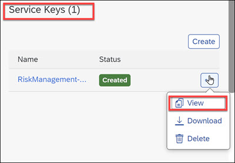
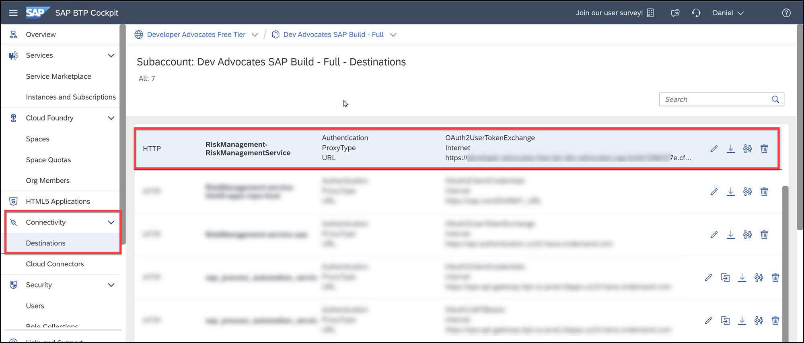

 

# Test CAP Service and its Destination
<!-- description --> Test the CAP service created with SAP Business Application Studio's productivity tools, including the destination automatically generated to expose it to SAP Build.

 
## Prerequisites
- You have created a CAP service, as described in [Create a CAP Service with BAS Productivity Tools](build-apps-cap-service).


## You will learn
- How to find and test the destination automatically created when you deployed your CAP service


## Intro
In order for SAP Build Apps to access your CAP service, a destination for the service is required. The destination was automatically created when you deployed the service with **Enable Discovery**.

In this tutorial we will test the destination using the credentials of the current user. We want to log into the service this way because we have defined roles, which can be assigned to specific users. So we need to know the current user.


---

### View service in BTP
Open your SAP BTP cockpit and navigate to the Cloud Foundry space where your service is deployed.


Click on the service, and then click on **Service Bindings**. Here you will `RiskManagement-uaa`


Finally, click on `RiskManagement-uaa`, and you will see a service key on the right, for which you can click **View** to get all the information that was used to build the destination.



>You won't need this information now, but if you make certain changes to the destination, you may need to provide the client secret, which is found in this file.


### View destination
1. Navigate back to your subaccount (`trial` if you are in your trial account).

2. Go to **Connectivity > Destinations**.

3. Select the destination `RiskManagement-RiskManagementService`.

    

    At the bottom of the page you will see all of the settings for this destination.


    Notice the additional properties that make it available to SAP Build Apps and SAP Build Process Automation.

    | Field    | Value | 
    | -------- | ------- |
    | Appgyver.Enabled  | true    |
    | WebIDEEnabled  | true     |
    | HTML5.DynamicDestination  | true    |
    | sap.processautomation.enabled  | true    |
    | sap.applicationdevelopment.actions.enabled  | true    |

    And notice that the authentication type is `OAuth2UserTokenExchange`, which enables the service to know what user is calling it. Most of the other settings for authentication come from the service key.


### Give your user roles
1. In the cockpit, go to **Security > Users**.

2. Find your user for the custom IDP, and on the right, click **Assign Role Collection**.

3. Search for `risk`, select both roles you created with your service, and click **Assign Role Collection**.

    


### Test service

1. Go back to SAP Business Application Studio.

    >It must be the BAS located on the same subaccount as your service and SAP Build Apps.

2. Open a terminal window.

    >Either go to hamburger menu **Terminal > New Terminal** or **View > Terminal**.

    

3. In the terminal, run the following commands separately:

    ```Bash
    curl http://localhost:8887/reload
    ```

    ```Bash
    curl https://RiskManagement-RiskManagementService.dest/Risks
    ```

    

    You should get the service document of the service.

    

    >**IMPORTANT:** If for some reason you do not get a response from terminal, continue on with the rest of the tutorial. 

4. If you remove the roles from your user, immediately you will see that you get a 403 error.

    