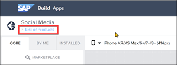
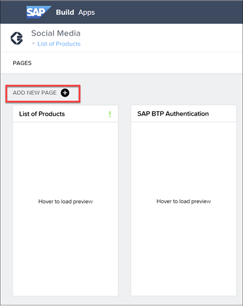
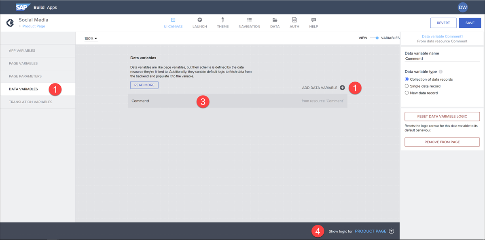
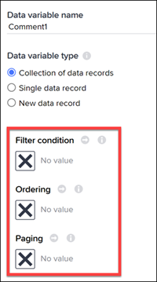
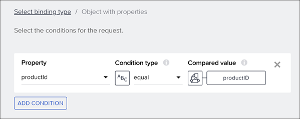
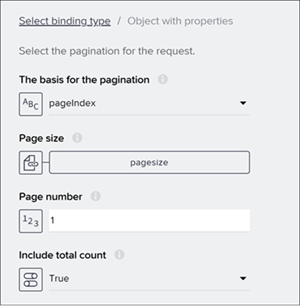
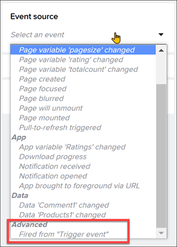
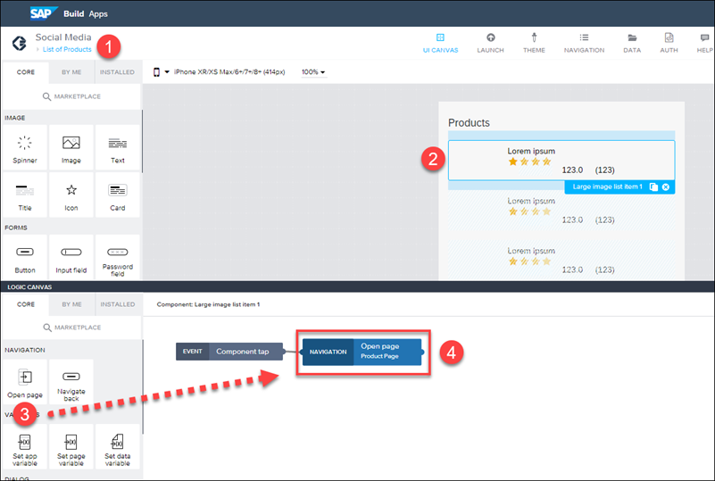
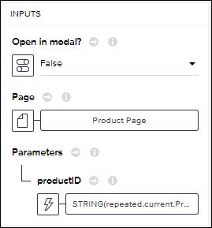

 

# Prepare a Product Page 
<!-- description --> Create a new, detail page and set up the infrastructure (i.e, variables and navigation) for the page.


## You will learn
- How to create a new page (detail page)
- How to navigate and pass a parameter to a different page 
- How to reuse logic flows
- How to create custom events
- How to use filtering, ordering and paging for an OData service


## Intro
The product detail page will let users see the current rating of a product, let them rate the product themselves, add a comment, and see all the comments for the product.


In this tutorial, you create the required variables, binding and logic, and in the next tutorial you will create the UI.


### Create a new page
1. In the upper left, click on the name of the current page.

    

2. Click **Add New Page**.

    

    Call the page `Product Page`.

    Click **OK**.

3. Delete all the components on the page, so the page is blank.


### Add variables to the page
1. Select **Variables**.

2. Under **Page Variables**, add the following page variables:

    

    | Variable | Type | Purpose |
    |-------|---------|--------|
    | **ratingcomplete** | True/false | Indicates the user gave a rating and we will disable the rating component |
    | **newcomment** | Text | Contains the text the user enters as a new comment |
    | **pagesize** | Number -- set initial value to 3  | The number of comments to display, which starts at 3 but can grow |
    | **rating** | Number | The rating given by the user for this product, bound to the star rating component's **Value** field    |
    | **totalcount** | Number | The total number of comments for this product, which we get as part of the call to the **Comment** entity |

3. Under **Page Parameter**, add the following page parameter:

    | Field | Type | Purpose |
    |-------|---------|--------|
    | productID | Text | The product to be displayed on the product page, received when the user clicks on a certain product in the list of products |

4. Under **Data Variables**, add a data variable based on the **Comment** entity (keep the name **Comment1**).

    Click on the new data variable, open the logic pane, and remove all of the flow functions.

    

    >We will put the logic in a central place, so we can reuse the flow functions.

5. Under **Data Variables**, add a data variable based on the **Products** entity (keep the name **Product1**).

    Set the type of variable to **Single data record**, and set the **ProductID** to the following formula:

    ```JavaScript
    NUMBER(params.productID)
    ```

    

    Click on the new data variable, open the logic pane, and remove the Delay flow function. 

6. Click **Save** (upper right).


### Enable refresh of comments
We want to refresh our comments data at many points in our app (e.g., user adds comment or user pages through comments). So we will put the logic in a central place, and create an event that we can call anytime.

1. Click in an open spot on the canvas, and then open the logic pane.

2. In the logic, create a logic flow like this:
 
    

3. For the **Get record collection**, set the resource name to **Comment**.
   
    Now set the filter, ordering, and paging.

    
   
    - For the **Filter condition**, select the **X** and select **Object with properties**.

        Click **Add Condition**, and set the property `productId` equal to the page parameter `productID`.
  
        

    - For the **Ordering**, select the **X** and select **List of values**.

        Click **Add Sort Option**, and set the sort property `dateCreated` and the sort direction to `desc`.
    
        

    - For the **Paging**, select the **X** and select **Object with properties**.

        Set the following values as follows (`pagesize` is the page variable):

        

4. For the **Set data variable** flow function, set the following:

    - **Data variable name** property to `Comment1`
    - **Record collection** to **Output value of another node > Get record collection > Collection of records**.

    

5. For the **Set page variable**, set `totalCount` variable to **Output value of another node > Get record collection > Total count**.

6. Drag a **Receive event** flow function (all the way at the bottom) onto the canvas.

    
   
    Set **Event source** to **Fired from "Trigger event"** (all the way at the bottom).
    
    

    Under **Advanced**, set the name of the flow function to `Refresh Comments`.

    

    >This creates an event called **Refresh Comments** that can be called from other logic flows.

    Connect the new event to the **Get record collection** flow function.
    
    

7. Click **Save** (upper right).


### Add navigation to this page
Whenever someone clicks on one of the products on the List of Products page, we want the user to open the Product Page for that product.

1. Go back to the List of Products page.

2. Select the list component, and open the logic pane.

3. Connect an **Open page** flow function to the tap event.
   
    
    
    With the flow function selected, in the **Properties** pane, set the **Page** property to **Product Page**.

    

    Set **Parameters > ProductID** to the following formula:

    ```JavaScript
    STRING(repeated.current.ProductID)
    ```

    

1. Click **Save**.


