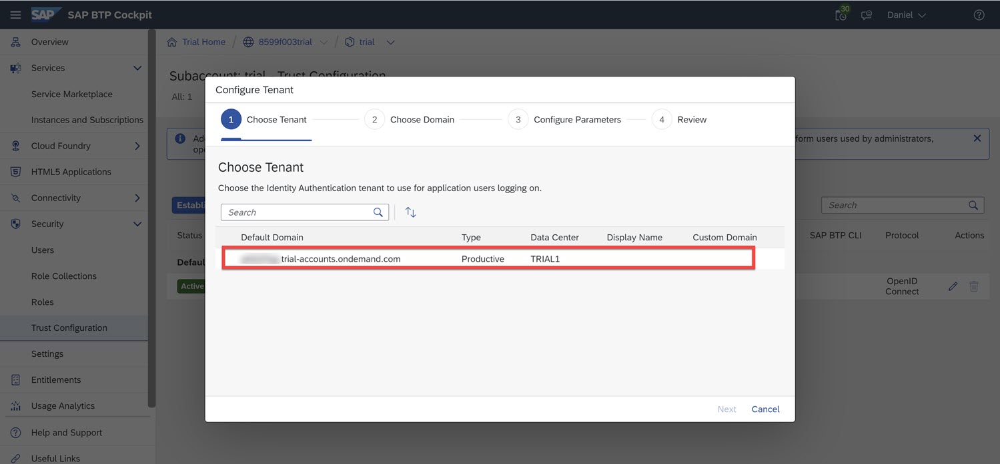
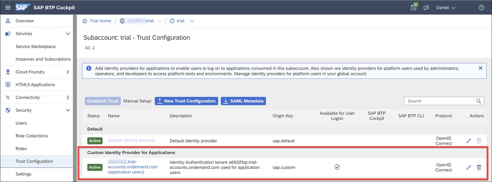
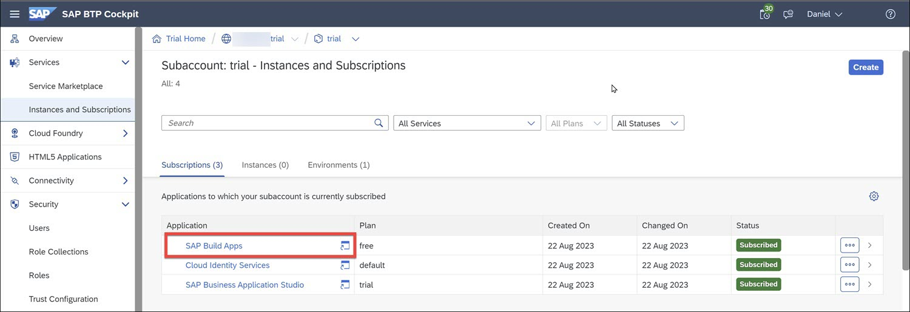
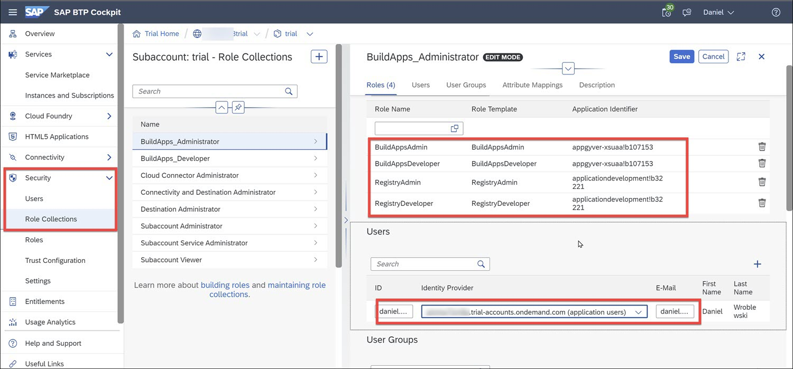
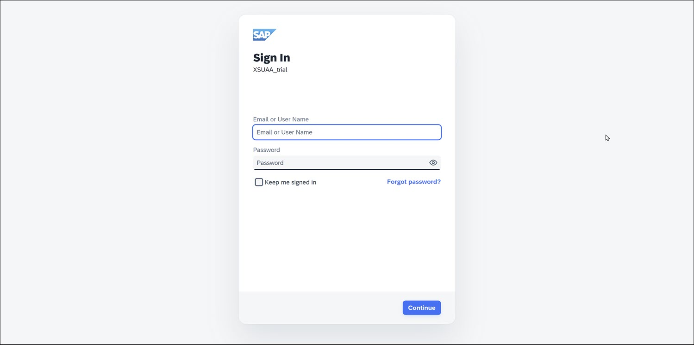

  

# Set Up SAP Build Apps on SAP BTP Trial Account
<!-- description --> Set Up SAP Build Apps on an SAP BTP trial account.

## Prerequisites
- You have created a trial account, as described in [Get a Free Account on SAP BTP Trial](https://developers.sap.com/tutorials/hcp-create-trial-account.html).
- Your trial account must be in the **US East (VA) - AWS** or **Europe - Frankfurt** region. 

## You will learn
- How to set up SAP Build Apps on your trial account

## Intro
>**IMPORTANT:** This is not official documentation, and SAP Build Apps is not officially supported on the SAP BTP trial landscape.

### Install Cloud Identity Service
SAP Build Apps requires that users be part of a custom identity provider. Therefore, you need to install the Cloud Identity Service.

1. In the cockpit of your subaccount, go to **Service Marketplace**.

    Search for **Cloud Identity Service**.

2. Click **Cloud Identity Service** and click **Create**.

    Select the `default` service plan, and click **Create**.

    The service will be created in a few seconds.

    You will get an email to activate your account on this new identity provide.

    

3. Click the button to activate your account, and follow the instructions for creating a password for this new custom identity provider. 

When you are done you will see a new browser tab with the administration UI for managing users and authorizations for this identity provider. There is nothing to be done on this screen.

### Establish trust
1. Navigate back to your subaccount.

    You can navigate back by doing the following:

    - Click the global account in the breadcrumb.
  
    - Click **Account Explorer**.

    - Click your subaccount.

    

2. In the cockpit of your subaccount, go to **Security > Trust Configuration**.

    Click **Establish Trust**.

    You should see the identity provider you created when you install the Cloud Identity Service.

    

    Select it, and click **Next**.

3. On the **Choose Domain** page, keep the settings and click **Next**.
    
    On the **Configure Parameters** page, keep the settings and click **Next**.

    Click **Finish**.

You should now have a custom identity provider in the trust configuration.

### Install SAP Build Apps

1. Navigate back to your subaccount, and go to **Instances and Subscriptions**.

2. Click **Create**.

    Select:

    | **Field** | **Value** |
    |-----------|-----------|
    | **Service** | `SAP Build Apps` |
    | **Plan** | `free` |

    Click **Create**. After a few minutes the SAP Build Apps is added to the subaccount.

    

### Set up roles
With SAP Build Apps, you have the following roles:

| Role | Purpose |
|-------|--------|
| RegistryDeveloper  | Provides access to the lobby to manage your own projects. |
| RegistryAdmin      | Provides access to the lobby to manage all projects. |
| BuildAppsDeveloper | Provides access to create projects in SAP Build Apps. |
| BuildAppsAdmin     | Provides access to create projects in SAP Build Apps and to manage all projects.  |

The 2 admin roles are grouped into the **BuildApps_Administration** role collection, and the 2 developer roles are grouped into the **BuildApps_Developer** role collection.

But after installing SAP Build Apps, only the Registry roles are added to the role collections, so you must add the others.

1. In your subaccount cockpit, go to **Security > Role Collections**.

2. Select **BuildApps_Administrator** role collection.

    Click **Edit**, and add the roles:
    
    - **BuildAppsAdmin**.
    - **BuildAppsDeveloper**.
    - **RegistryAdmin**.
    - **RegistryDeveloper**.

    Add your user but select the new custom identity provider.

    Click **Save**.

3. Select **BuildApps_Developer** role collection.

    Click **Edit**, and add the roles:
    
    - **BuildAppsDeveloper**.
    - **RegistryDeveloper**.

    Add your user but select the new custom identity provider.

    Click **Save**.

    

4. Go to **Security > Users**, and add the role collections **BuildApps_Administrator** and **BuildApps_Developer** to your custom identity provider user (NOT the default provider user).
   
    

### Open SAP Build Apps
In the cockpit of your subaccount, go to **Instances and Subscriptions**.

Click on **SAP Build Apps** (or the little icon) to view the SAP Build lobby.

You will be asked to log in with the user you set up with the custom identity provider.

You should now see SAP Build Apps.

😺
