# Check Status of Process from SAP Build App
<!-- description --> After triggering a process, you can check the status of that process by calling SAP Build Process Automation APIs from your SAP Build app.

## Prerequisites
- You created the Sales Order Trigger application, as described in [Create SAP Build App to Trigger Workflow](build-apps-workflow-trigger).

## You will learn
- How to store the process ID
- How to call an API to get information about your process instance
- How to create and update local on-device storage

## Intro
In addition to triggering a workflow, you can call other APIs to get information about the status of the workflow, the tasks within a workflow, and a whole lot more.

In this tutorial, we will create a new page to display the processes we have triggered, and let the user click a button for each to check it's status.

You can see all the APIs you can call related to SAP Build Process Automation in the [SAP Business Accelerator Hub](https://api.sap.com/package/SAPProcessAutomation/all). Select the API you are interested in, and then click **View the API Reference**.

---

### Create local storage for process information
Each time we trigger a process, we want to save the process instance ID so that we can later get information about the process, like its status, by calling other SAP Build Process Automation APIs. For this, we will use on-device storage.

On-device storage is meant to keep info only needed by the current user, especially state information or settings. You can get a sense of on-device storage in this video, [SAP Build Apps tutorial Part 2 - Creating a to-do list saved in local storage](https://www.youtube.com/watch?v=EbCW__JN4CM).


1. Open the **Create Sales Order** app you created in the previous tutorial.
   
2. Go to the **Data** tab.

3. Under **On-device storage**, click **Create Data Entity**.
    
    
    
    Call the storage `Workflows`, and click **Add**.

4. To the Workflows entity, add the following fields (click **Add New** for each field):

    | Field Name    | Type    |
    | --- | --- |
    | **processID**    | _Text_    |
    | **status**    | _Text_    |
    | **dateTriggered**    | _Text_    |

    Click **Save** (upper right).

    

5. Click **Save** (upper right).


### Store process ID
1. Go back to the UI canvas of the **Create Sales Order** page.

2. Click the **Get Approval** button, and open its logic canvas.

    You should already see **Create record** and **Toast** flow functions from the previous tutorial.

3. Drag a second **Create record** flow function right after the first one and before the **Toast** flow function.

    Reconnect the flow functions like the following:

    

    >**IMPORTANT:** If a flow function has 2 outputs, use the top one.

    >Every flow function can define different outputs depending on the result of the flow function. Many flow functions -- including **Create record** -- have one output for success (top) and one output for an error (bottom).

4. Click the new **Create record**, and set the following:

    - For **Resource name**, select **Workflows**.

        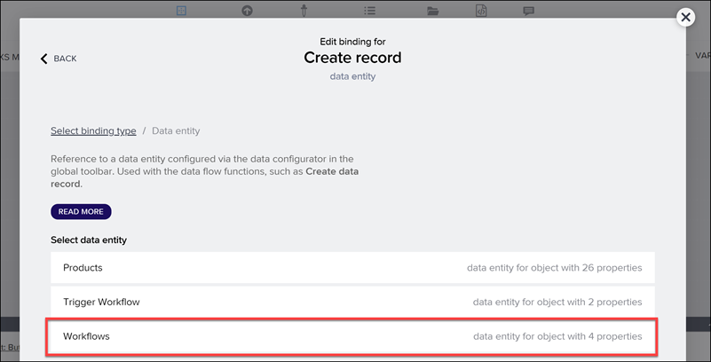

    - For **Record**, click the **Custom object**, and enter the following for each of the following fields:

        | Field         | Value                                                                              |
        | ------------- | ---------------------------------------------------------------------------------- |
        | **processID**     | Select the formula binding and use: <div></div>```outputs["Create record"].response.id```     |
        | **status**        | Select the formula binding and use:<div></div> ```outputs["Create record"].response.status``` |
        | **dateTriggered** | Select the formula binding and use:<div></div> ```NOW()```                
        
        

        >**NOTE:** The first 2 formulas may give you an error but this is OK. We did not define a specific schema for the response from SAP Build Process Automation API, so SAP Build Apps does not recognize the field and suggests it is wrong. But you can still save the formula.

        >
    
    Click **Save**, and then **Save** again in the upper right.                    


### Create UI for page to display process info
In this step, we will design the page to display a list of all the processes the user has started, and for each there will be a button for the user to get updated status on each one. 

1. Click on the **Create Sales Order** page link.
    
    
    
    This opens the pages areas.

    Click **Add New Page**, call the new page `Workflow Status`, and click **OK**. 

2. Change the title component text ( **Content** property ) to `Workflow Status`. (Select the title component and go to the **Properties** tab on the right.)

3. Remove the text component.  

4. Drag a container component to the page.
    
    Add another container inside the first container, and in the new container add a button, and 2 text components. It might be easier to drag the components to the **Tree** view.
    
    It should look like this:

    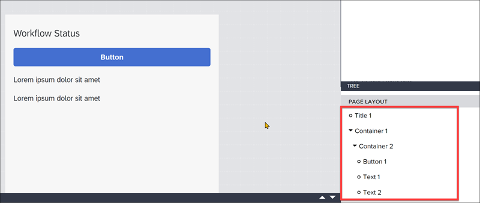

5. Click the outside container, go to the **Style** tab, scroll to the bottom, and select the style we created in a previous tutorial, **Layout Form Container**.

    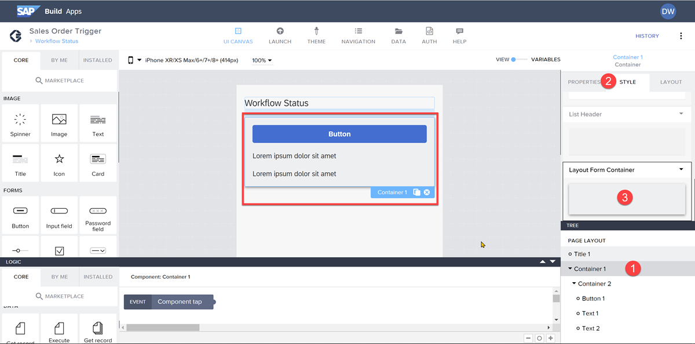

    >This is the style we created for forms when we created the list of sales order fields on the **Create Sales Order** page. Now we can reuse it 😀.

6. Select the inside container, and in the **Layout** tab, make the following changes:

    - Layout to horizontal
    - Align components to middle

    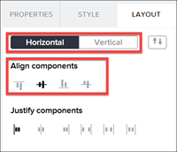

    The page should now look like this:

    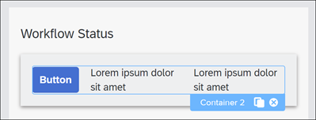

7. Select the button, and make the following changes:

    - Set the label to `Status`
    - In the **Layout** tab, change the width to **Fit content**.

    Click **Save** (upper right).

The page should look like this:


### Create navigation
Since we now have 2 pages, we need a way to get from the first page to the second page, and back again. We will use the built-in navigation system to do this.


1. Click the **Navigation** tab.

    The default navigation should already be enabled and you should already have an entry for the Home Page that will point to the Sales Order Trigger page. 

    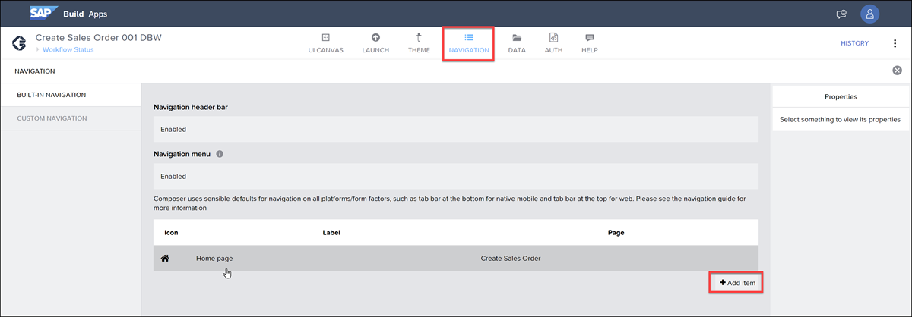

2. Click **Add item**.

    This should automatically add the **Workflow Status** page to the menu, with the same name for the tab name.

    >If not, change the **Tab name** and **Page** to `Workflow Status`.

3. Click **Save** (upper right).


### Create data variable and binding
We now need a data variable to hold the list of workflows that we triggered, so we can bind the data to our UI.

1. Go back to the UI canvas, and open the **Variables** area.
    
    Select **Data Variables** on the left.
    
    Click **Add Data Variable**, and base the new variable on the **Workflows** data resource.
    
    

    Open the logic canvas, and remove the **Delay** flow function.

    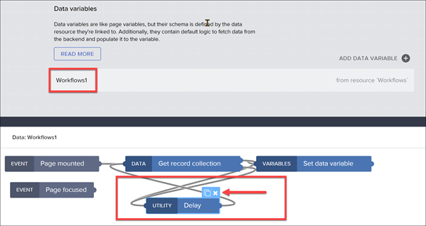

    Lastly, lets display the processes in chronologically order. Select the **Get record collection** flow function, and in the **Properties** tab:
    
    - Click the **X** next to **Ordering**.
    - Change the binding to **List of values**.
    - Click **Add Sort Option**, and set the values to `dateTriggered` and `desc`.

    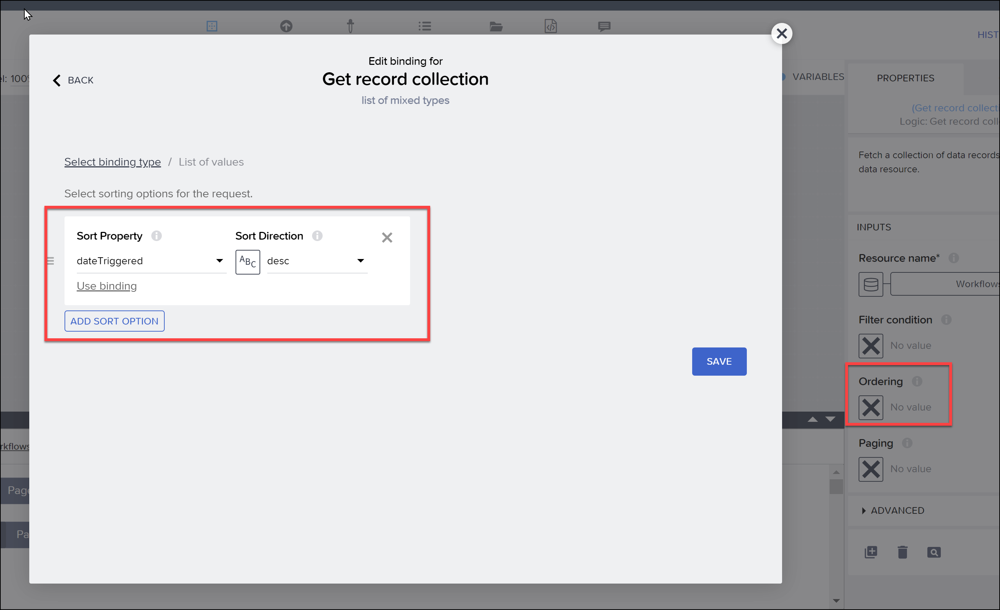

2. Click **View** to return to the UI canvas.

3. In the **Tree** view (bottom right), select the inside container, **Container 2**.

    In the **Properties** pane, select **Repeat with** and then choose **Data and Variables > Data Variables > Workflows1**, and then click **Save**.

    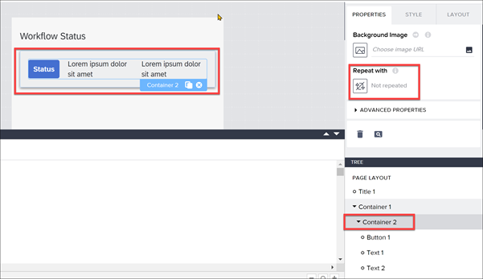

    You should now see 4 rows, each with **Status** button and text fields.

    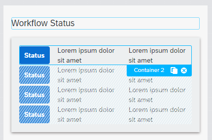

    >**Repeat with:** You will see 4 duplicates of any component that has a binding for **Repeat with**, just to show you there is a binding.
    >
    >If you want to change something with the bindings, only the first (original) components will be selectable.

4. Bind the text fields.

    Click the **Process ID** text field (first one), and for the **Content** binding, select **Data item in repeat > current > processId**, and click **Save**.

    Click the **Status** text field (second one), and for the **Content** binding, select **Data item in repeat > current > status**, and click **Save**.

    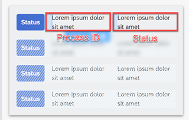

5. Click **Save** (upper right).

Rerun your app ( **Launch > Open Preview Portal > Open Web Preview** ), enter fields for the sales order, and click **Submit** to trigger the workflow.


Click the navigation to open the **Workflow Status** page, and you should be able to see the same process ID and its last status, **Running**.

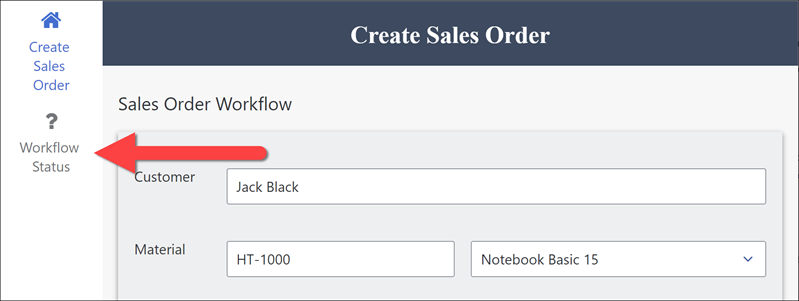


### Create data resource for status API
In the previous step, we saved the process ID and status, but the status could have changed in the meantime. So we want to be able to click **Status** and get the latest status from an SAP Build Process Automation.

1. Open the **Data** tab.

2. Scroll down to **SAP Build Apps classic data entities**, and then click **Create Data Entity > SAP BTP Destination REST API Integration**.

3. On the **Base** panel, enter the following:

    | Field                | Value                                         |
    | -------------------- | --------------------------------------------- |
    | Data resource name   | `Workflow Information`                             |
    | BTP destination name | `sap-process-destination` (or the destination you created, if you created your own) |

    Under **Resource schema**, click **Add New** and add a field of type _Text_ and with the name `ProcessID`.

4. Click the **create** panel.

    Then enable the create action with the toggle button.

    

    &nbsp;<br>

    

5. For **Relative path and query**, click the binding **X** (next to the name of the destination), then select **Formula > Create Formula**.

    Use the following for the formula:

    ```JavaScript
    "/" +  query.record.processId
    ``` 

    Click **Save** twice.

    It should now look like this:

    

6. Change the **Request method** to **GET** (from **POST**).

7. Click **Save Data Entity** (bottom right).

8. Click **Save** (upper right).

Now you can test it if you have an ID of a process instance in SAP Build Process Automation.

>You can get the instance ID by going to the Monitor tab (starting from the SAP Build lobby), and on the left clicking **Monitor > Process and Workflow Instances**.

>Then click on your latest running process. On the right, you can click the copy button next to the **Instance ID** field.

>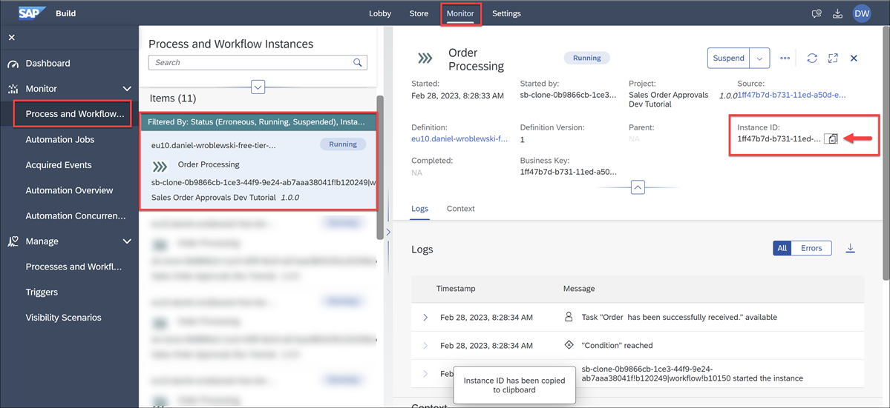

With the instance ID, open the **Workflow Information** data resource again, go to the **create** action, then open the **Test** tab, enter a process instance ID for **ProcessID**, and click **Run Test**. 

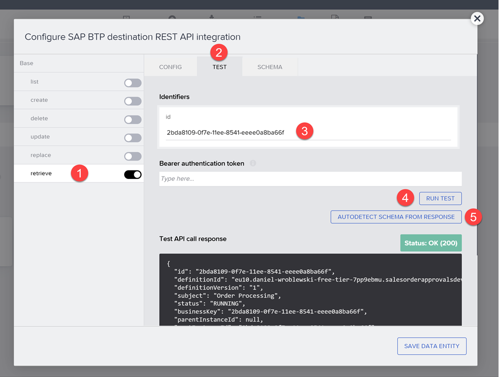

You should get information about the process, including the process ID, start time, and status.

>You could suspend a process briefly -- click **Put on Hold** in the **Monitor** tab for that process instance.
>
>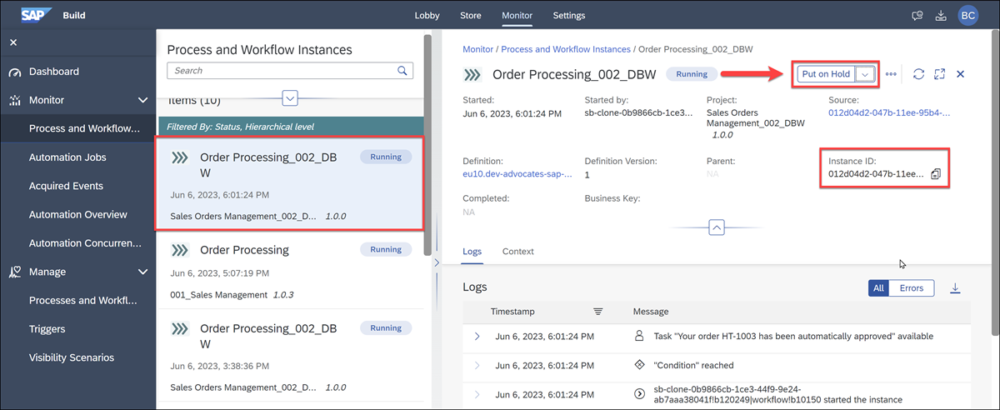
>
>Then rerun the status API and see that it is suspended. 
>
>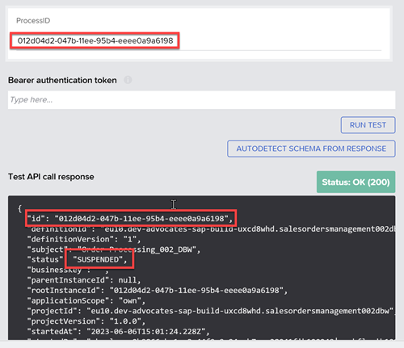
>
>You can then simply resume the process in the **Monitor** tab.


### Create logic to retrieve status
1. Close the **Data** tab.
   
2. In the **Workflow Status** page, click the **Status** button (in the first row), and open the logic canvas for it.

3. Create a logic flow as shown in the following image.
    
    >Always use the top output for flow functions with more than one output. 

    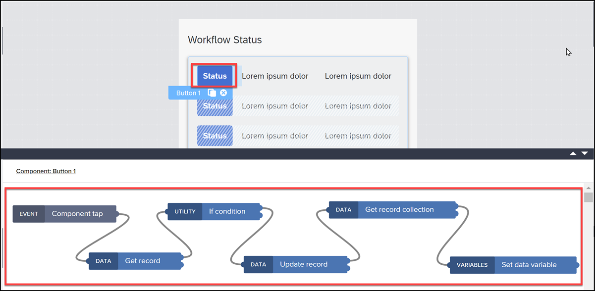

    > **What's going on?**
    >
    >The set of flow functions does the following:
    >
    >1. **Create record:** Retrieves the status of a specific workflow.
    >
    >2. **If condition:** Checks if the status is different from what is recorded in the local on-device storage.
    >
    >3. **Update record:** If the status is different, updates the status in your local storage.
    >
    >4. **Get record collection:** Retrieves the updated list of processes from your local storage.
    >
    >5. **Set data variableCreate record:** Updates the data variable with the data from the API call, which updates the UI.

4. For the **Create record** flow function:

    - **Resource name:** Set to **Workflow Information**. 
    - **Record:** Click **Custom object**, and bind the **ProcessID** field to **Data item in repeat > current > processId**. 

5. For the **If** flow function, bind the **Condition** field to the following formula:

    ```JavaScript
    repeated.current.status != outputs["Create record"].response.status
    ```

6. For the **Update record** flow function:

    - **Resource name:** Set to **Workflows**. 
    - **ID:** Bind to **Data item in repeat > current > id**.
    - **Record:** Click on **Custom object**, and then change the binding for **status** to the following formula:
  
        ```JavaScript
        outputs["Create record"].response.status
        ```  

        It should look like this:

        

7. For the **Get record collection** flow function, just change the **Resource name** to **Workflows**.

    So that the processes are listed with the newest ones on top, click **Ordering**, and then bind to **List of values**. Add the sort property **dateTriggered** and set the sort direction to **desc**. 
    
    Click **Save**. 

8.  For the **Set data variable** flow function:
   
    - **Data variable name:** Set to **Workflows1**.
    - **Record collection:** Bind to **Output value of another node > Get record collection**, click **Collection of records**, and then click **Save**.

9.  Click **Save** (upper right).


### Run app
Run the app again (it should refresh on its own), and click the navigation to go to **Workflow Status**. You should see something like this, with ***Running*** status.


Go to SAP Build Process Automation, and just suspend the process.


Then go back to your app and click **Status** for the process. The status should change to ***Suspended***.

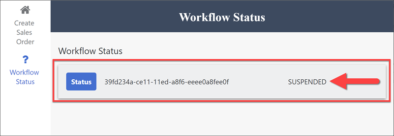
