  

# Create SAP Build App to Trigger Workflow
<!-- description --> Trigger a workflow created in SAP Build Process Automation from an app created with SAP build Apps.

## Prerequisites
- You set up SAP Build App and entered the lobby.
- You set up SAP Process Automation, and created the process described in the tutorial group [Create a Sales Order Process and Enable Triggering Via API](https://developers.sap.com/group.sap-build-apps-process-trigger-enable.html).
- You know the `definitionId` for the process you created.
- You have set up the destination to SAP Build Process Automation, as described in [Create Destination to Trigger Process from any Service](https://developers.sap.com/tutorials/spa-create-service-instance-destination.html).


## You will learn
- How to create a simple UI
- How to create a form
- How to stylize your UI
- How to trigger from your app a workflow in SAP Build Process Automation


## Intro
This tutorial shows you how to use SAP Build Apps to create and stylize a simple, one-page app that triggers an SAP Build Process Automation workflow.

Specifically, the app lets the user enter sales order details and then send these to a process for approval. (In a real-world scenario, the sales order would then be created in S/4HANA Cloud, but that is not part of our flow.)

Your app will look something like this:

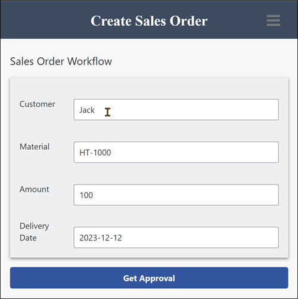

&nbsp;

>**Before You Begin:** You will need:
>
>- The name of the SAP BTP destination to your SAP Build Process Automation instance. The destination **MUST** be configured with the URL of the entire path of the SAP Build Process Automation [Workflow Instances API](https://api.sap.com/api/SPA_Workflow_Runtime/resource).

>   **For workshops, the destination will be created for you and the name of the destinations will be provided to you**. 
>
>- The `definitionId` for your specific workflow, which you can find within your trigger in SAP Build Process Automation project. You can get this by going to your triggers in the deployed version of your project, and clicking **View**.

>   Copy the payload to a text editor, and there you can copy just the definition ID.

>   


---

### A few important UI concepts

Before you begin, we want to help you understand how apps are developed with SAP Build Apps.

Every app is built on a UI canvas – the canvas is the background of the app. On the canvas, you drag and drop components: text fields, input boxes, toggle bars, images and many other components you want the user to interact with.

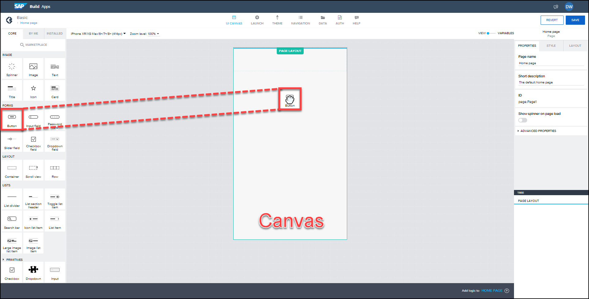


Every component has properties, for example: the text to display, the value of the input box and so forth. You select the component and then its properties appear in the **Properties** pane to the right.


Each property is bound to something, for example:
* Static text
* A variable (whose value can be updated elsewhere)
* Data from a backend
* A formula

For the property, you click the binding button ...


... and then select from a menu of bindings.


Finally, for every component there are events, for example, when a user taps a button or enters data in an input box. You can capture these events and then perform an action – like display a dialog, create data in a backend, change the value of variables and much more.

This is done on the logic canvas. Select a component (or no component if you want to capture app events), and then open the logic canvas.

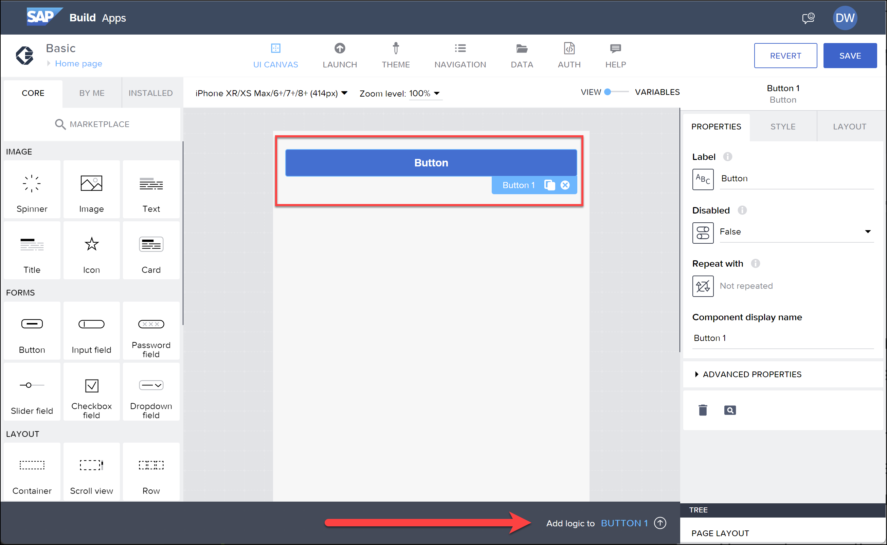

You then drag and drop flow functions and connect them to events. The flow functions are executed whenever that event occurs. And, of course, each flow function has properties to bind 😺.


### Create a new app project
Go to the SAP Build lobby, and click **Create**.


Select **Build an Application**.

   

Select **Web & Mobile Application**.

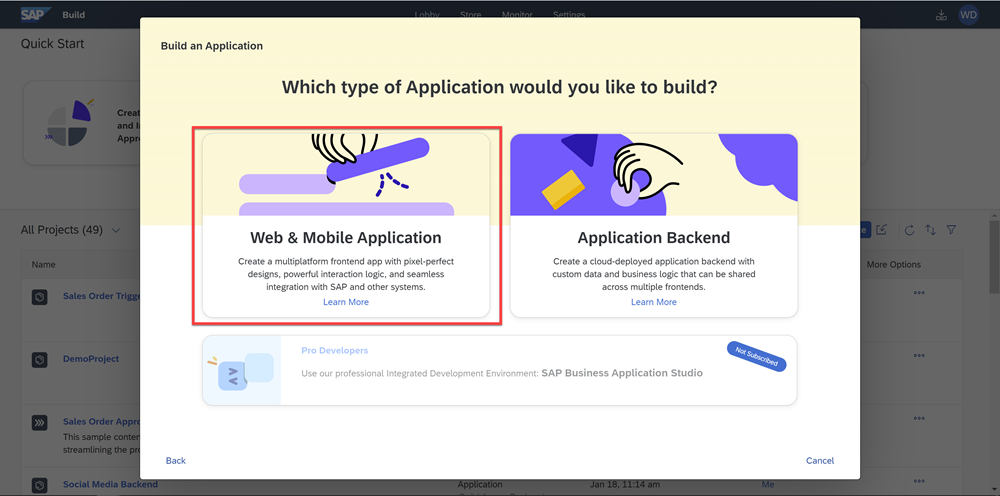

>**IMPORTANT:** In the next step, if you are in a workshop, please use a unique identify for the name of your app, such as `Create Sales Order 001 DBW` – based on your SAP BTP user name or and based on your initials.
 
For the project name, enter `Create Sales Order`, then click **Create**.
  


### Create the sales order page
By default your new application contains a page with title and text fields. In this step, you will focus on turning this page into your app – by adding components like input boxes and buttons, and then styling them. 

This is known as creating the user interface, also known as the UI.

>Note that there are 2 tabs for this tutorial step. 
>
>- You can do the first tab, **Basic steps**, which we recommend and which will teach you about UI components, stylizing them, and organizing them on the page.
>
>- You can instead do the second tab, **Import Project**, which will bypass the nitty gritty of adding and stylizing components, and instead teach you how to import an SAP Build Apps project into an existing project. This way is much faster.
 

[OPTION BEGIN [Basic Steps]]

1. Select the text field, and click the **X** to delete it.

    

2. Click on an open area (this brings up the **Properties** tab for the app instead of for a specific component), and in the **Properties** tab, change the **Page name** to `Create Sales Order`.

    

4. Click the title field, and in the **Properties** tab change the **Content** text to `Sales Order Workflow`.

    

5. To the canvas, drag a Container component. 

    >Container components let you group components and configure the collection of the components as a single unit.

    With the container selected, in the **Properties** tab, change the **Component display name** to `Form`.

    

    Still with the container selected, open the **Style** tab, click the dropdown icon for the Layout Container, and click **Edit**. 

    

    - For the background color, select **Level 4 background**.

    - For padding, set the padding on all 4 sides to 16px by clicking each rectangle, going to **Theme**, and selecting the **L** size.

        

    - For **Effects**, create a shadow by setting these properties:

        | Field | Value |
        |-------|----------|
        | **Enable Shadow**    | True   |
        | **Shadow size**    | Content Shadow 0   |
        | **Shadow color**    | `#8e8989`<div>&nbsp;</div>Click the **X**, and then select **Static color**. You can then copy and paste in the color code, or use the color picker to choose a color. |

    - Let's save the style by scrolling up in the **Style** tab, clicking **New Style**, entering `Layout Form Container`, and clicking **OK**. 

        

    This saves the new style in the **Style** tab.

6. Into this container ( **Form** ), drag in another container.
   
    >It may be easier to drag it into the **Tree** view on the lower right, so you can put it precisely where you want. The **Tree** makes it easier to select specific components and to create a hierarchy of components on the page.

    Inside the new container add a text and input field. The result should look like this:

    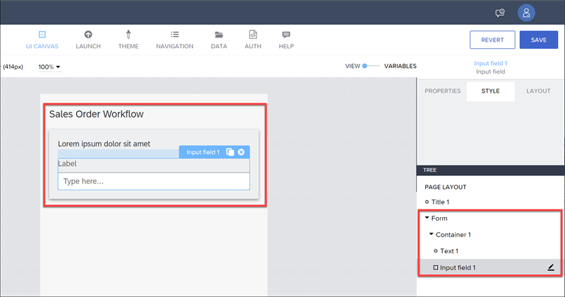

    Select the new, inner container ( **Container1** from the **Tree** view), go to **Layout** tab, and under **Layout** set the container to **Horizontal**. Then, set **Align components** to middle.

    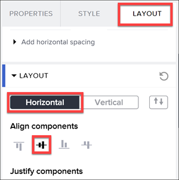
    
    Select the text field, go to the **Layout** tab, then **Width and Height**, and set the width to exactly 75px.

    
    
    Select the input field, and in the **Properties** tab, delete `Label` from the **Label** property.  

7. From the **Tree** view, select the inside container ( **Container1** ).

    
 
    Duplicate the container by clicking on the **Duplicate** icon.
   
    
 
    Repeat this 2 more times, until you have 4 fields.

    

8.  Click on each field label and change it to the following field names, in this order:

    | Fields | 
    |-------|
    | Customer    | 
    | Material    | 
    | Amount    | 
    | Delivery Date    | 

    

9.  At the bottom of the page (outside the outside container), add a button.

    In the **Properties** tab, set the **Label** to `Get Approval`.

    

    In the **Style** tab, next to **Primary Button**, click the dropdown button and select **Edit**.

    For **Background color**, change the color `Brand` to `Highlight`.

10. Click **Save** (upper right).

[OPTION END]

[OPTION BEGIN [Import Project]]

We really want you to see some of things related to stylizing you can do with SAP Build Apps. But we understand that stylizing a UI may be tedious for some people.

If you really want, you can skip doing the stylizing and instead import the project already stylized. If you want to take this route, do the following:

1. Download the file [`Sales-Order-Trigger.zip.gpg`](https://github.com/sap-tutorials/sap-build-apps/raw/main/tutorials/build-apps-workflow-trigger/Sales-Order-Trigger.zip.gpg).

2. Click the 3 dots next to **History** in the upper-right corner.

     

3. Select **Replace**.

4. Select the file you downloaded.

5. Click **Replace**

Click **Done** and you can go to the next step.

[OPTION END]


### Enable SAP BTP authentication
You need to enable SAP BTP authentication because you want to use SAP BTP destinations, and users need to be authenticated to use them.

SAP BTP destinations are connections to backend services – each specifies the location of a backend and how the user will be authenticated. The destinations can be used by the various services within SAP BTP, including SAP Build Apps.  

SAP BTP authentication also has the benefit of requiring authentication in your app and reusing the built-in SAP BTP authentication mechanism.

1. Go to the **Auth** tab.

2. Click **Enable Authentication**.

    

3. Select **SAP BTP Authentication**.

    On the confirmation popup, click **OK**. 


### Create data resource to SAP Build Process Automation
As part of setting up SAP Build Process Automation, you created an SAP BTP destination that points to SAP Build Process Automation APIs, so that you can trigger workflows.

Now you will set up the connection from your app to that destination, so you can call SAP Build Process Automation.

>Note that there are 2 tabs for this tutorial step. 
>
>- You can do the first tab, **Basic Steps**, which we recommend and which will teach you about many of the features and s for data resources.
>
>- You can instead do the second tab, **Import Data Resource**, which will bypass the nitty gritty of setting up the data resource, and instead teach you how to search the Marketplace and install a data component.


[OPTION BEGIN [Create Data Resource]]

1. Open the **Data** tab, at the top of the page.

2. Scroll down, and and under **SAP Build Apps classic data entities**, click **Create Data Entity > SAP BTP Destination REST API Integration**.

    

    The configuration screen appears, starting with the **Base** panel.
 
3. On the **Base** panel, enter the following:

    | Field                | Value                                         |
    | -------------------- | --------------------------------------------- |
    | Data entity name   | `Trigger Workflow`                             |
    | BTP destination name | `spa-process-destination` (or the destination you created, if you created your own) |

    

4. Under **Resource schema**, click **Add New**.

    
   
    Add a field of type **Object** and with the name `salesorderdetails`, and click **Add**.

    

    Click on the new field, and add the following sub-fields to the object:

    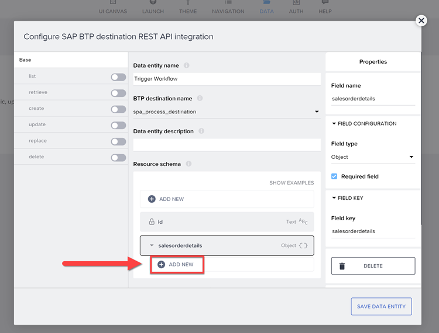

    >**IMPORTANT:** Click on the **Add New** button **BELOW** the `salesorderdetails` field.

    | Field Name           | Type   |
    | -------------------- | ------ |
    | **`ShipToParty`**          | ***Text***   |
    | **`Material`**             | ***Text***   |
    | **`OrderAmount`**          | ***Number*** |
    | **`ExpectedDeliveryDate`** | ***Text***   |
    | **`Division`**             | ***Text***   |
    | **`SalesOrderType`**       | ***Text***   |
    | **`ShippingCountry`**      | ***Text***   |
    | **`SalesOrganisation`**    | ***Text***   |
    | **`DistributionChannel`**  | ***Text***   |

    >**IMPORTANT:** Enter the fields exactly as shown above because casing it important and otherwise SAP Build Process Automation will not match what you send with the fields you defined there. Also, there is no date type in this window, so dates should be entered as text fields.

4. Click the **create** panel.

    Then enable the create action with the toggle button.

    
    &nbsp;<br>

    

5. For **Request headers**, click the binding **X**, then **List of values**.

    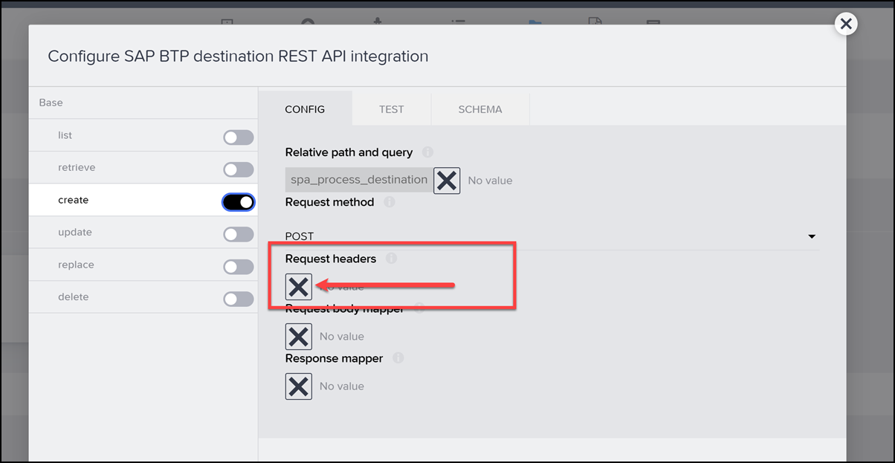

    Click **Add a value**, and add the following key-value pair:

    | Field            | Value              |
    | ---------------- | ------------------ |
    | **Header name**  | `Content-Type`     |
    | **Header value** | `application/json` |

    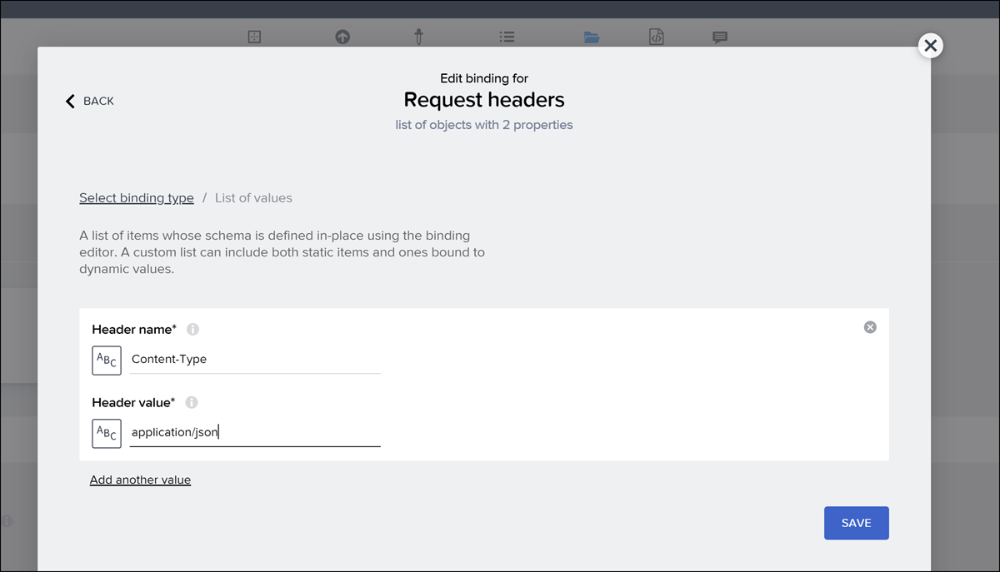

    Click **Save**.

6. For **Request body mapper**, click the binding **X**, then **Formula > Create formula**.

    Enter the following for the formula -- replace `<your definition ID>` with the ID for your process that you saved from your process trigger:

    ```JavaScript
    ENCODE_JSON({  "definitionId": "<your definition ID>",  "context":  query.record })
    ```

    >If you forgot the `definitionID` for your process, you can simply open the deployed version of your SAP Build Process Automation project, and view the trigger you created. This was all explained in the previous tutorial [Run the Sales Order Business Process](https://developers.sap.com/tutorials/spa-academy-run-salesorderprocess.html).

    The formula should look something like this:

    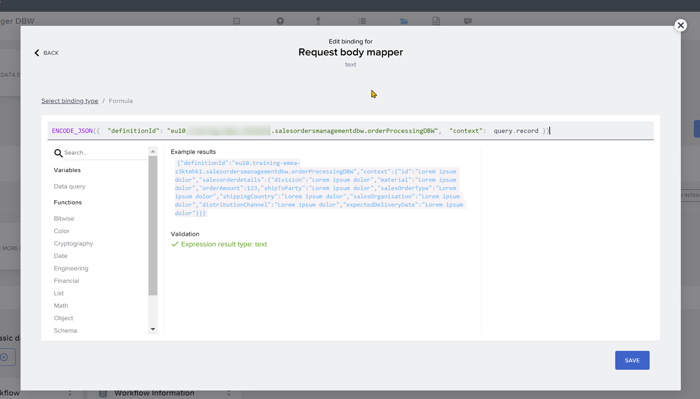

    Click **Save** twice.

    >The request body mapper will format the body of this HTTP request. For SAP Build Process Automation trigger API, the body provides the name of the process you want to trigger, plus all the input fields defined for that process.

7. Click **Save Data Entity** (bottom right).

    Click **Save** (in the upper right to save all your changes to the project).

[OPTION END]

[OPTION BEGIN [Import Data Resource]]

>If you started to create the data resource yourself, just delete the data resource and start with the instructions in this tab.

1. On the main UI Canvas, click **Marketplace**.

    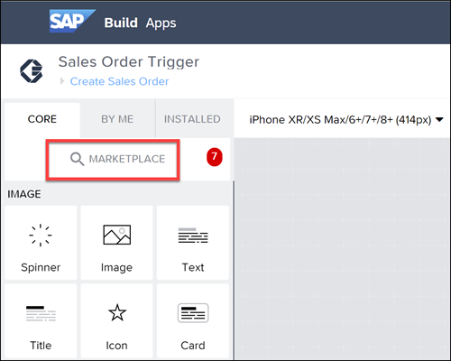

2. Search for: `gCgeEdbUoiC5FrwvHEOs-Q`

    You should see the Trigger Workflow.

    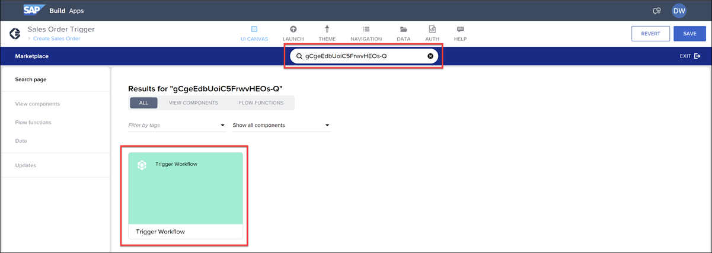

3. Select the **Trigger Workflow** component, and click **Install.

    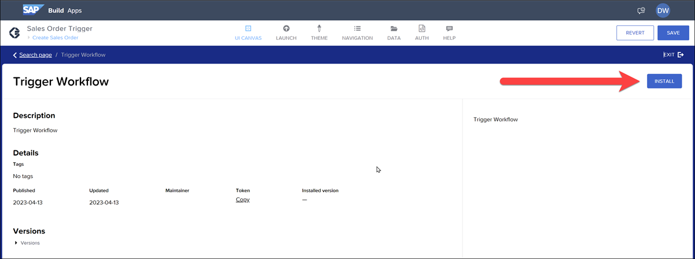

4. Open the **Data** tab, and open the **Trigger Workflow** data resource.

    

    Click **create**, and open the formula for the **Request Body Mapper**.
     to your definitionId

    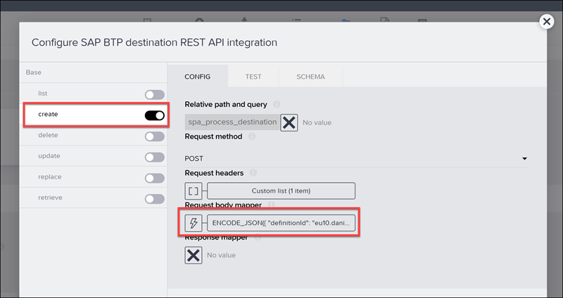

    The only thing you need to do is change the formula so the `definitionId` is equal to the `definitionId` for your process. 

    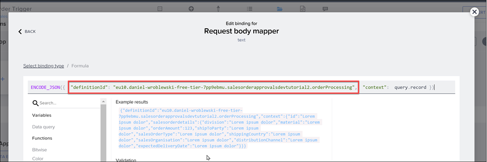

    >You can find the `definitionId` of your process in the lobby. In the lobby, go to **Monitoring > Manage Process and Workflows**, and search for your process by project/process name.


5. Click Save twice.
   
6. Click **Save Data Entity** (bottom right).

    Click **Save** (in the upper right to save all your changes to the project).

[OPTION END]


### Test the trigger
SAP Build App enables you to test whether your connection works. Here, we will trigger the workflow manually.

1. Open the data resource again by clicking it.
   
    

2. Click **create** on the left, and then the **Test** tab.

3. Enter values for the fields (really, you only need to enter an order amount), and then scroll down and click **Run Test**.

    >**IMPORTANT:** Date fields must be in the format of `2022-12-25` and the order amount must be a number.

    


If all works OK, you will get a **201** status code and a response with information about the process instance you just triggered, something like this:

```JavaScript
{
  "id": "54988e48-8056-11ed-9a13-eeee0a99244a",
  "definitionId": "us10.my-account.salesorderapprovals.orderProcessing",
  "definitionVersion": "6",
  "subject": "Order Processing",
  "status": "RUNNING",
  "businessKey": "54988e48-8056-11ed-9a13-eeee0a99244a",
  "parentInstanceId": null,
  "rootInstanceId": "11118e48-8056-11ed-9a13-eeee0a99244a",
  "applicationScope": "own",
  "projectId": "us10.my-account.salesorderapprovals",
  "projectVersion": "1.0.5",
  "startedAt": "2022-12-20T11:06:19.318Z",
  "startedBy": "sb-clone-41c25609-33a1-9999-97d8-34fcd2316008!b3591|workflow!b116",
  "completedAt": null
}
```


> **COMMON ISSUES**
>
>**403:** The destination to the SAP Build Process Automation API is not configured properly. Make sure the client ID, secret, service URL and authentication URL (with `/oath/token` path) are set correctly. Do not add user/password for the authentication URL.
>
>**404:** The API did not recognize the name of your process (i.e., `definitionId` in the request body mapper) or the path to the service is wrong -- both in the **create** tab.
>
>**415:** You did not send the `Content-Type` request header.
>
>**422:** This basically means that the API heard your call but it didn't like something in the request body.
>
>- The format of a field may be wrong, for example, text for a number field or an invalid date format (dates must be in this format: `2023-01-31`). 
>
>**500:** This may mean that your URLs are wrong, especially, you may have the wrong URL for OAuth authentication, such as you forget to add the path `/oauth/token`.
>
>Note that field names are case sensitive. This will not cause an error in the API call, but the values will not be passed to the workflow properly and you will not see the values in the workflow forms.

If you've gotten to here, your integration with SAP Build Process Automation is working!!

You can go into the SAP Build Process Automation monitoring and see there the process you just triggered, and check the context to make sure the parameters were sent properly.

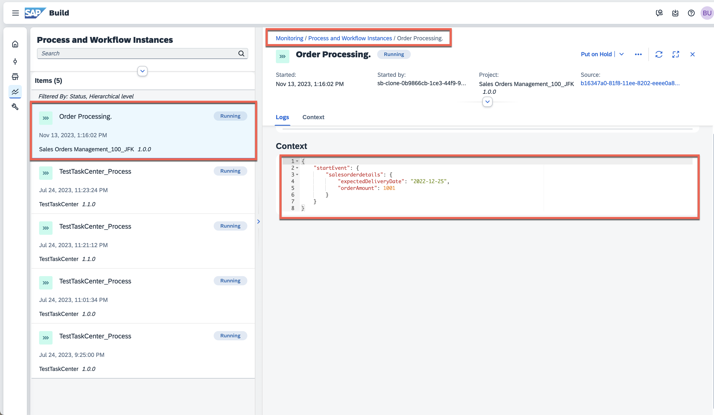

You can also check the Inbox to see the forms were created and the values properly passed into the workflow.


In any event, you can close your data resource definition by clicking **Save Data Entity**.


### Create data variable
Whenever we want to trigger a workflow, we need to send some data – in this case, the sales order information.

So we will create a variable that will hold the information. A data variable is based on a specific data resource -- in this case the one to trigger our workflow -- and the variable's schema is automatically duplicated from the data resource.

1. Back on the UI canvas (click the **UI Canvas** tab at the top), select **Variables**.

2. On the left, click **Data Variables**.

    >If you get a big text box saying **Welcome to Variables**, you can read it but then you can close it by clicking the **X**.

    >
   
3. Click **Add Data Variable**, and choose **Trigger Workflow** as the data resource on which to base the data variable.

    >The schema of the data variable will be the same as the data resource.

    

    

4. On the right, choose **New data record**.

    

5. Click **Save** (upper right).

>Make sure the name of the data variable is exactly `Trigger Workflow1` with no extra spaces or characters.
>
>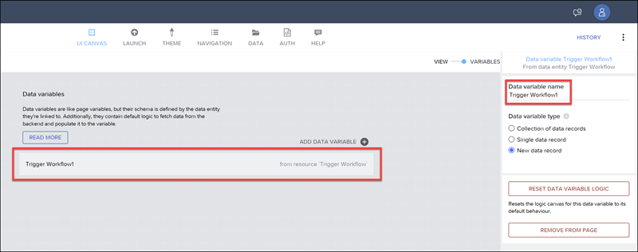


### Bind data variable to UI elements
We created a variable for the sales order data, but now we need to get the data entered by the user into the variable. We do this by binding the variable to UI elements, specifically, to the input boxes.

Whenever someone types into the input box, the value is automatically copied into the variable.


1. Go back to **View** so you can see the UI canvas.
   
2. Click on the first input field (for **Customer**).

    In the **Properties** tab, click the **X** next to the **Value** field, and select **Data and Variables > Data Variables > Trigger Workflow1 > shipToParty**.

    

    Click **Save**

3. Click on the second input field (for **Material**).

    In the **Properties** tab, click the **X** next to the **Value** field, and select **Data and Variables > Data Variables > Trigger Workflow1 > material**.

    Click **Save**

4. Click on the third input field (for **Amount**).

    In the **Properties** tab, click the **X** next to the **Value** field, and select **Data and Variables > Data Variables > Trigger Workflow1 > orderAmount**.

    Click **Save**

5. Click on the fourth input field (for **Delivery Date**).

    In the **Properties** tab, click the **X** next to the **Value** field, and select **Data and Variables > Data Variables > Trigger Workflow1 > expectedDeliveryDate**.

    Click **Save**

6. Click **Save** (upper right).


### Add logic to trigger workflow
We need to set up the logic so when someone clicks the **Get Approval** button (an event), we send the sales order data to our SAP Build Process Automation workflow using the data resource we previously created. 

1. Click on the **Get Approval** button, and open the logic canvas by clicking **Add logic to Button1** at the bottom right.

    

2. Drag a **Create record** flow function onto the canvas, and connect the component tap event to it.
   
    

3. Click on the **Create record** flow function and configure it in the **Properties** pane on the right.

    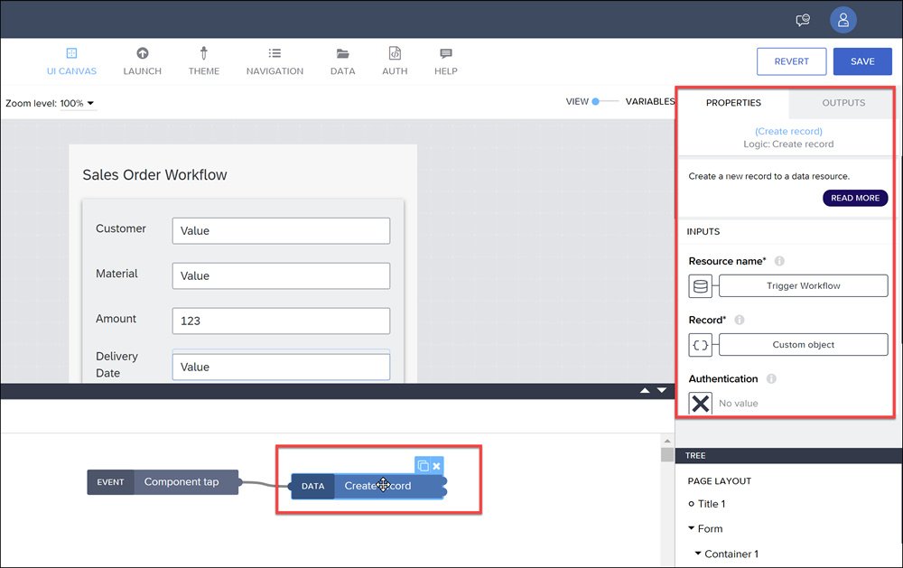

    For **Resource name**, this should already be set to **Trigger Workflow**, since you have only one data resource.

    
    
    For **Record**, you have to bind each of the data variable fields to the appropriate record field. 

    There are many ways to do binding. For **Record**, you will use a formula simply because it is faster, though formulas are one of the most important binding types and provide a lot of flexibility.
    
    Click on the object binding button:
    
     
    
    Click **Formula**, then click on the existing formula, and replace it with the following:
   
    ```JavaScript
    {salesorderdetails: {shipToParty: data["Trigger Workflow1"].salesorderdetails.shipToParty, material: data["Trigger Workflow1"].salesorderdetails.material, orderAmount: NUMBER(data["Trigger Workflow1"].salesorderdetails.orderAmount), expectedDeliveryDate: data["Trigger Workflow1"].salesorderdetails.expectedDeliveryDate, division: "1010", salesOrderType: "OR", shippingCountry: "Barbados", salesOrganisation: "10", distributionChannel: "1000"}}
    ```

    >**IMPORTANT:** The formula assumes that you named your data variable `Trigger Workflow1`, which should be the default name if you named your data resource `Trigger Workflow`.

    >A typo in the name of the data variable, like an extra space, will mess up the binding.

    Click **Save**.
    
    >**What does the formula do?**
    >
    >The 4 main fields we want to send should already be in our data variable, since we bound it to the input boxes. But we need to:
    >
    >
    >- Format the number value for the order amount (if not it will sent as string and this will cause an error).
    >- Send values for some other fields (for future use).
    >
    >You can do all this field by field -- using the **Object with properties** binding -- but to save time we gave you the formula.
    >
    >If you want to explore, open the binding for the **Record** field and select **Object with properties** and you can see the UI where you can set each field by hand.
    
  


4. Drag a **Toast** flow function onto the canvas, and connect the **top** output of the **Create record** flow function to it.

    

5. Click on the **Toast** flow function and configure it in the **Properties** pane on the right.

    For **Toast message**, click on the **ABC**, and then select **Formula > Formula**.

    

    Erase the quotation marks, and enter the following formula:

    ```JavaScript
    "Triggered process with ID: " + outputs["Create record"].response.id
    ```

    Click **Save**.

6. Click **Save** (upper right).


### Run app
1. Click the **Launch** tab, and then **Open Preview Portal**.

    

3. Click **Open web preview** (left).

4. Select your project, **Select Order Trigger**.

    

5. Enter the following values in your form:

    | Field | Value |
    |-------|-------|
    | Customer | `Joe's Bikes` |
    | Material | `HT-1000` |
    | Amount  | `100000` |
    | Delivery Date  | `2023-03-31` |

6. Click **Get Approval**. When the toast message appears take a screenshot.

Your process should be triggered and require approval (since the amount is 100,000 or above).

You should see the toast message indicating the workflow was triggered, and with the process instance ID.


You can also see the results of the call in SAP Build Process Automation.

Go to the **Monitor** tab, then **Monitor > Process and Workflow Instances**. The first one should be the one you just triggered.

- You can see the new process instance.
- You can see the process ID is the same as in the toast message in the app.
- You can see the context, which is the values sent with the API (4 of them, in yellow, you entered in the input fields and the others were hardcoded in the formula for the **Create record** flow function).
- You can also see the execution log, which shows that the process stopped at the approval step (since it was at least 100,000) and is awaiting approval. If you expand the approval step you can see more information, including who the approval request was sent to.


