  
# 1 - Create the Product List Page
<!-- description --> Import a skeleton project for the SAP Build CodeJam, and create a simple product list page based on ES5 data.

## Prerequisites
- You have completed the previous tutorial for the SAP Build CodeJam, [Set Up Prerequisites for SAP Build CodeJam](codejam-0-prerequisites).

## You will learn
- How to create a new SAP Build Apps project
- How to import a project
- How to get data from a destination
- How to add components to a page
- How to bind data to UI elements
- How to change component styles
- How to preview your app

## Intro
In this exercise, you will be importing an already created skeleton app to your SAP Build Apps lobby. We've provided the skeleton app so you do not have to create all the UI elements for all the pages.

For this page, the product list page, you will design the entire UI, including styles and layout. For all pages, you will create the data connections, variables, logic, and navigation.

For this product list page, you will connect to the ES5 service to get names, descriptions and images of products. At the end of this exercise, your homepage (product list page) will look something like this.

### Open the SAP Build lobby
If you already have the SAP Build lobby open from doing the prerequisites, you can skip this step.

Otherwise, here's how top open the lobby.

1. Go to the your trial account at [https://account.hanatrial.ondemand.com/](https://account.hanatrial.ondemand.com/).

    Sign in if necessary

2. Click **Got To Your trial Account**.

    

    This brings you to your "global" trial account.

3. Click your subaccount tile.

    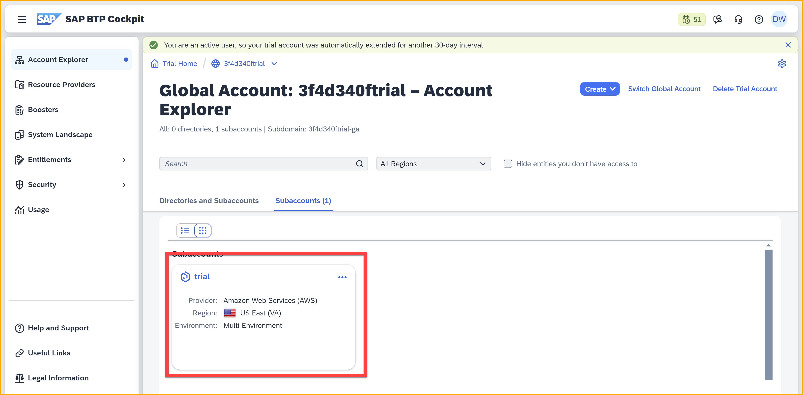

3. Click **Instances and Subscriptions**.

    

4. Click the icon next to **SAP Build Apps** or next to **SAP Build Process Automation**.

    

    Sign in with your custom IDP (identity provider) user you created when installing SAP Build Apps.

    This should open the SAP Build lobby. Yours should be empty.

    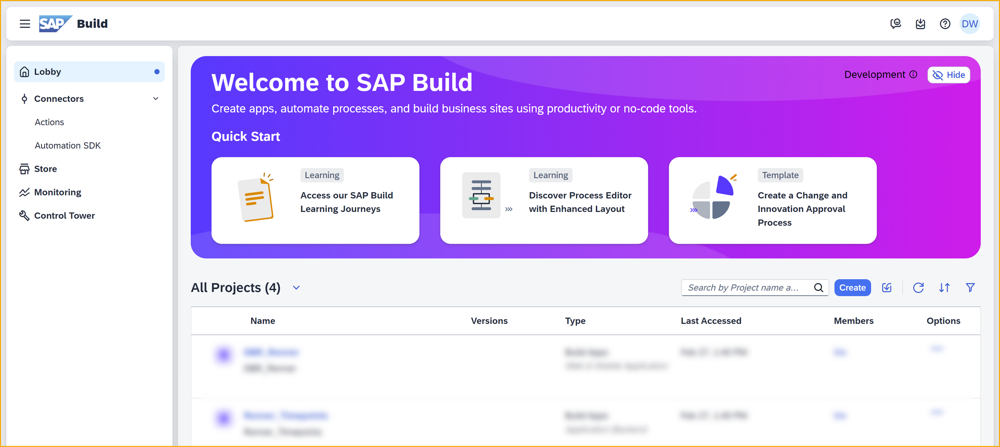

  

### Import the skeleton app project

1. Download this skeleton project.

    Click [ShoppingApp.zip.gpg](https://github.com/sap-tutorials/sap-build-apps/blob/main/tutorials/codejam-01-homepage/ShoppingApp.zip.gpg), and then click the download button.

    

2. In the SAP Build lobby, click the **Import** button.

    

3. Click **Browse files** to select the project file you downloaded. After a few seconds, it will be uploaded.

    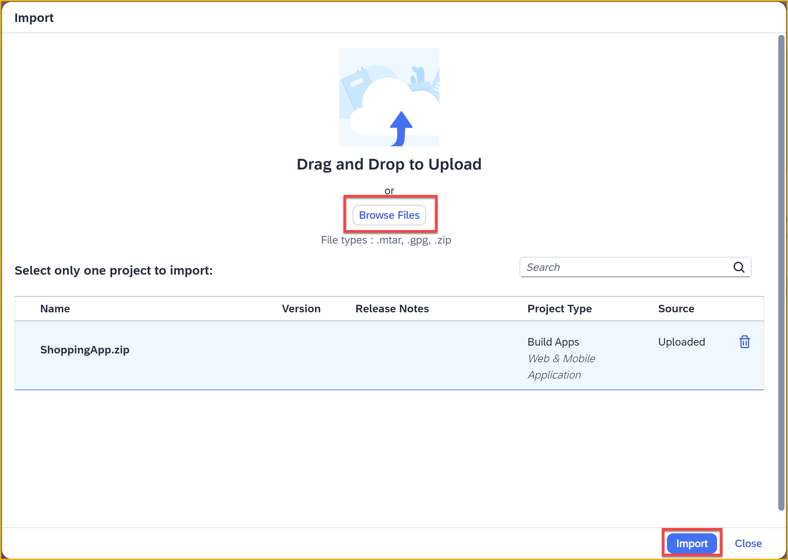

    Select the file, and click **Import**.

    The project should now be added to the lobby.
    
        
    
4. Click the project **ShoppingApp** to open it.

### Enable BTP Authentication
You need to enable SAP BTP authentication because you want to use SAP BTP destinations, and users need to be authenticated to use them.

SAP BTP destinations are connections to backend services – each specifies the location of a backend and how the user will be authenticated. The destinations can be used by the various services within SAP BTP, including SAP Build Apps.

1. With your new project open, go to the **Auth** tab.

    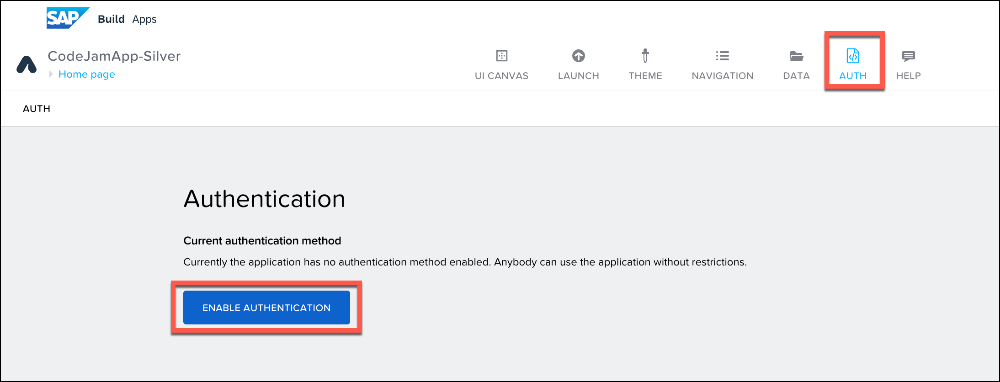

    Click **Enable Authentication**.

2. Select **SAP BTP Authentication**.

    
    
    Click **OK**.

3. Click **Save** (upper right).

    

### Enable a data entity
Since you have already performed the steps in the prerequisites tutorial, you should have a destination to the ES5 shopping API that points to a service to return a list of products.

Now you must create the connection between your app and the ES5 system.

1. Open the **Data** tab.

    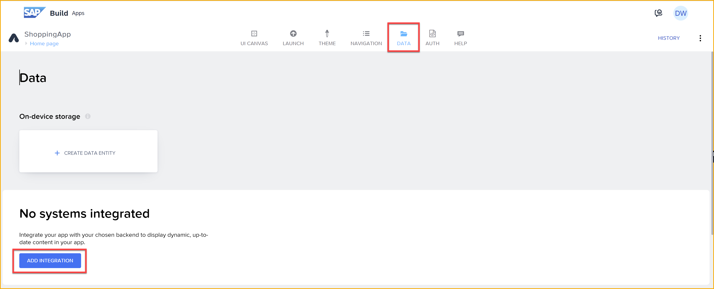

    Click **Add Integration**.
   
2. Click **BTP Destinations**.
    
    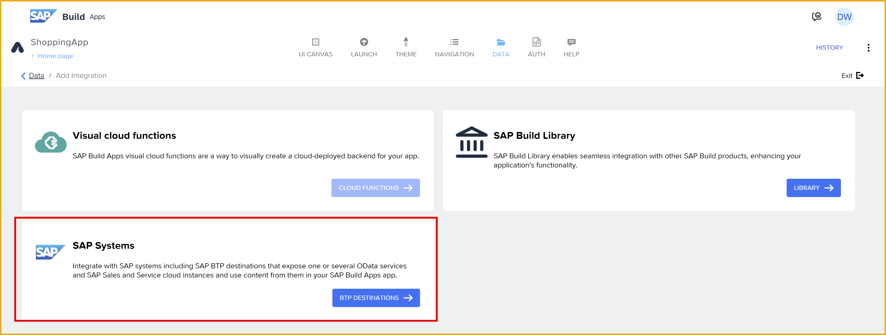

3. Find the **ES5-Shop** destination, and click it.

    

    This will show all the entities available in this service.

    

4. Click **Install Integration** (top right).
   
5. Select the **Products** entity, and click **Enable Data Entity**.

    

    You should see the entity as **Enabled**.

    

6. Click **Save** (upper right).

    Click **Exit** (upper right) to return to the previous – **Data** – screen. 

    You should now see the **Products** entity in the **Data** tab.

    

### Create a data variable
Data variables are used for holding data from external data sources, such as SAP systems or third-party APIs. They come with a logic canvas that automatically comes with logic for retrieving the data – you do not have to worry about this logic. You can "bind" the data in the variable with your UI components in order to display the data. 

All this makes it possible to build SAP extensions that interact with and enhance core systems.

1. Switch to the **UI Canvas** tab and then toggle to **Variables**.

    

    >If you get a big text box **Welcome to variables**, you can read it but then you can close it by clicking the X.

    >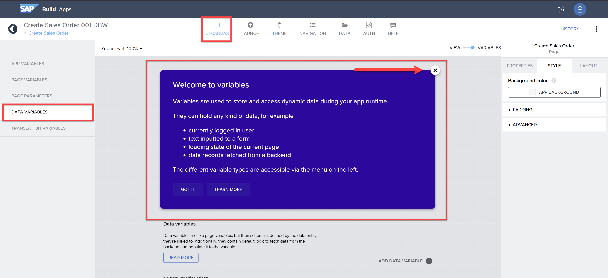
    >
    >SAP Build Apps with an amazing help system, which provides embedded help when and where you need it. But if it is too much for you, you can always turn it off by going to the **Help** tab, and checking the checkbox for turning it off.
    >
    >

2. Access the **Data Variables** tab on the left of the screen.

3. Click on **Add Data Variable** and choose **Products**.
   
    

    Keep the default selections shown on the right pane as it is.

    

    >These settings determine the type of data variable (e.g., whether a collection of records or a single record), the default logic for retrieving data, and the filtering, pagination and other settings when retrieving data.

4. Click **Save** (upper right).
   

### Add UI elements to the homepage

1. Toggle back to **View**.
   
    

2. From the **Core** tab of the left pane, drag a **Container** component from under **Layout > Container** onto the canvas into the white area.

    >Container components let you group components and configure the group of components as a single unit.

    With the container selected, in the **Properties** tab, change the **Component display name** to `Container - Products List`.

    

3. Into this container, drag and drop a **Title** field. The result should look like this:

    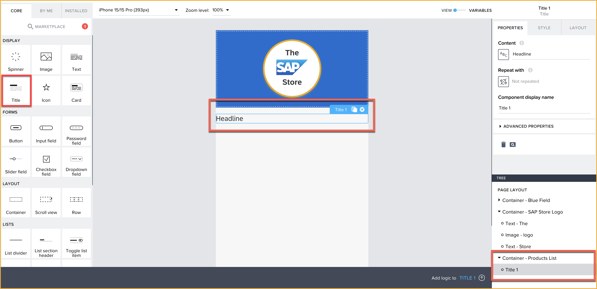

    >It may be easier to drag it into the **Tree** view on the lower right, so you can put it precisely where you want. The **Tree** makes it easier to select specific components and to create a hierarchy of components on the page.

4. With the **Title** component selected, and in the **Properties** tab on the right pane, enter `Buy some hardware today!` for the **Content** property. 

5. From the **Core > Lists** section nearly at the bottom of the left-side components pane, drag a **Large image list item** into the **Container - Products List** container (after the title component).

    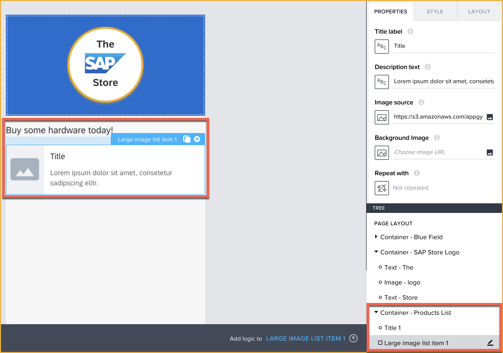

6. From the **Tree** view (bottom right), select the container **Container - Products List** again.

    Open the **Style** tab from the right pane, click the dropdown icon for the **Layout Container**, and click **Edit**.

    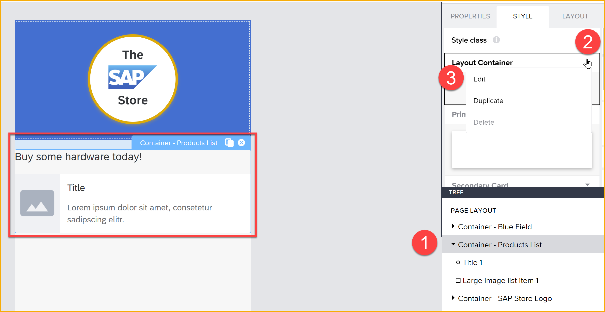

    >Each component has a default style, plus additional alternative built-in styles you can choose. In addition, you can make changes to the current style, which changes the style for the current instance of the component only.

    >If you want, you can update the default style with your changes so it affects all components ( **Overwrite** ), or you can save your changes to a new style ( **New Style** ). 

    Expand the **Padding** settings, set the padding on all 4 sides to 24px by clicking each rectangle, going to **Theme** tab, and selecting the **XXL** size.
   
    

    Let’s save the style by scrolling up in the **Style** tab, clicking **New Style**, entering `Layout List Container`, and clicking **OK**. This saves the new style in the **Style** tab and now can be used on other containers in your app.

    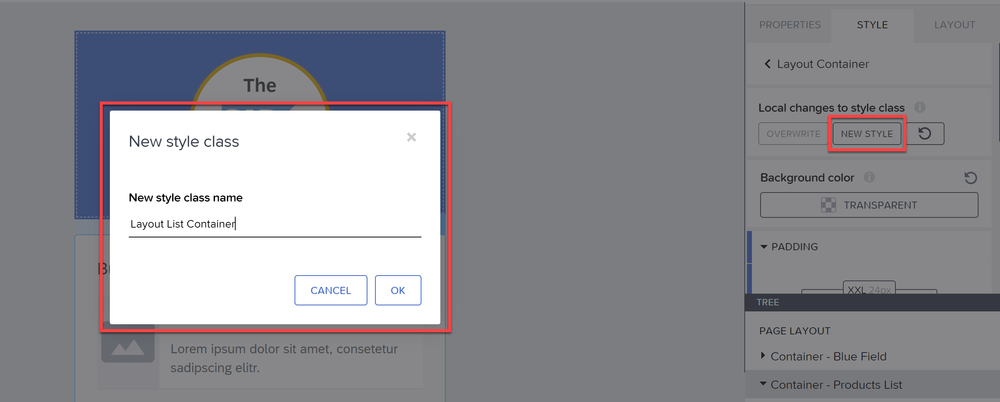

    You should be able to see some nice padding around the content.
    
    

7. Click **Save** (upper right).

### Bind data variable to UI elements
You created a data variable for the **Products** data, and the logic for retrieving the data was created automatically. Now you need to tell the app how and where you want to display the data.

To do this, you create bindings for your UI components – in this case, the list item. You indicate what data you want to display in your component, whether from:

- Static values

- Calculated values

- Values from variables

- ... or other sources

>**How binding works**
>
>When you configure a UI component (or later a logic component called a "flow function"), generally you do this with binding.
>
>For most properties, there is a binding icon that indicates what type of binding is used. For example, you can use **static text** for a text field, or you can show text from a backend service and use a binding to a **data variable** 
>
>In the example below, it shows an icon with **ABC**, meaning that this is static text and will not change.

> 

>If you want to change the binding type, just click the binding icon and you will be shown binding types that are valid for the current property.
>
>If you want to keep the binding type, but change the actual binding (e.g., the text to display), then update the field to the right of the binding icon.

1. Select the **Large image list item** on the canvas.
   
    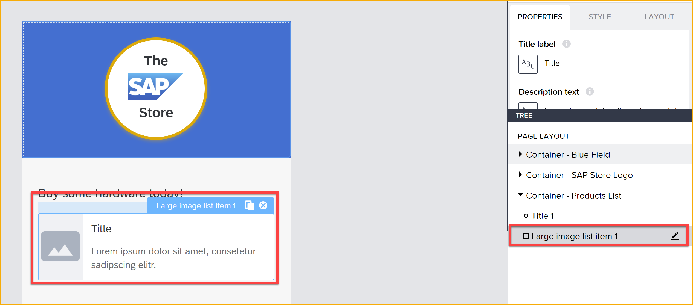

2. In the **Properties** tab, there are properties we will want to set, specifically:
   
    - The title 

    - The description

    - The image

    

    But we want the component to be repeated for each item in our list (each product). So first, we will set the **Repeat with** property.
    
    Click the icon next to **Repeat with**.
    
    

    Select **Data and Variables**.

    

    Then select **Data variable**, and then select your **Products1** data variable, and click **Save**.
    
    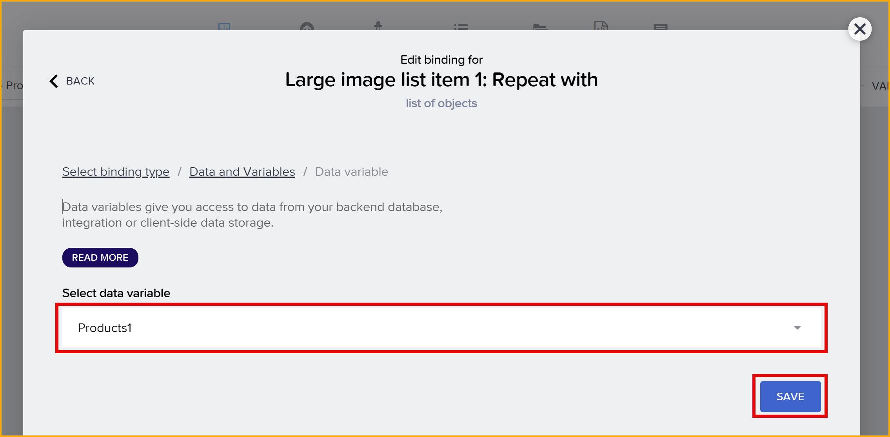

3. Back in the **Properties** tab you can now select each of the binding icons for the 3 properties we want to set.

    
    
    Set each property by clicking the binding icon and the setting the binding as follows:

    | Field | Binding |
    |-------|---------|
    | Title label | **Data item in repeat > current > Name** |
    | Description text | **Data item in repeat > current > Description** |
    | Image source (see note below) | Formula > `'https://sapes5.sapdevcenter.com' + repeated.current.ImageUrl` |

    >To set a formula, click on the default formula. 
    >
    >
    >
    >This opens the formula editor with the default formula loaded. Select all of the default formula, and replace with the formula we gave you.
    >
    >

    >The formula for the image may appear in red as an error, but it will still work. Go ahead and save it!
    >
    >One of the strengths of the formula editor is that it checks the data types of the properties you are setting to try to determine if the formula is compatible. Here, it is expecting a value defined as an image URL, but our text – which is a valid URL – will work just as well.

4. Click **Save** (upper right).

You may now test the app to see the products list.

>**What's with the repeat?**
>
>The **Repeat with** property lets you create multiple copies of a component by supplying a list – this will repeat the component based on the number of elements in your list, for example, the number of products in our list. The list can be hardcoded, or can be located in a variable (like in our case), or based on a formula.
>
>Once you set the **Repeat with** property, you then get the **Data item in repeat** binding option for the other properties in the component. You can now access values within each list item. So the data in the first item will be displayed in the first copy of the component, the data in the second item in the second copy of the component, and so on.

>

>That is what we did. We had a data variable as a list of product objects, repeated our component based on the number of products in the data variable, and then accessed individual fields (like the title and description) to be displayed in the component. 

### Test the App
1. Go to the **Launch** tab, then **Open preview portal** Portal.

    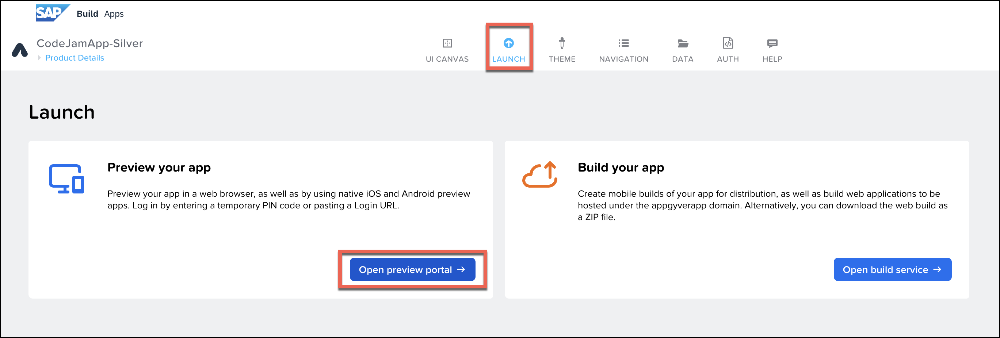

    Click **Open web preview**.

    

    You will get a list of apps in your lobby – at this point you should have just one. 
    
    
    
    There is a search bar to help you find your app when you become a master and build dozens and dozens of apps.

2. Click the **ShoppingApp** tile.
   
    You should be able to view the list of products.
   
    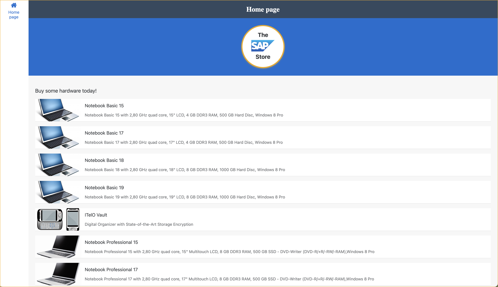

### Restyle the image
In the preview, you might have noticed that the product images are a little large for the space provided. Let's fix this.

1. In your project, click the **UI Canvas** tab.

    Double-click the **Large Image List Item** component. 

    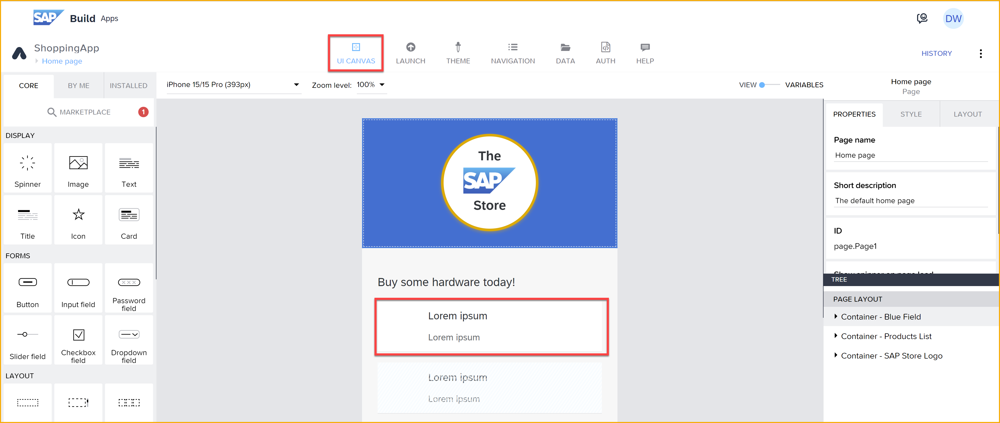

    This opens the Component Style Editor for the **Large Image List Item** component, a "custom" component built from many other basic components (more on custom components later). In this editor, you can access all the subcomponents and control their styles.

2. Select the **Image** component (either on the canvas or in the **Tree** view).

    

3. In the **Layout** tab on the right, do the following:

    - Change **Right gap** to 24px.
  
        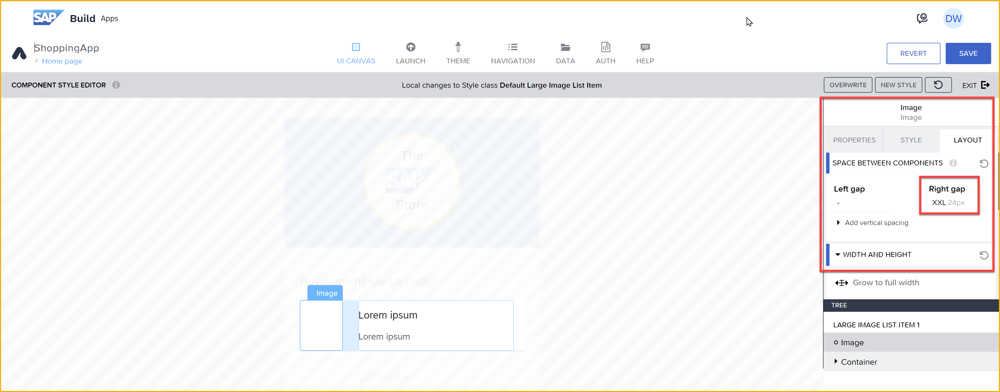

        >Click anywhere to close the selection dialog.

    - Under **Width and Height**, change the **Custom** values to **Set width** and **Set height**, and set them both to **64px**. Delete all the other values so it looks like this:

        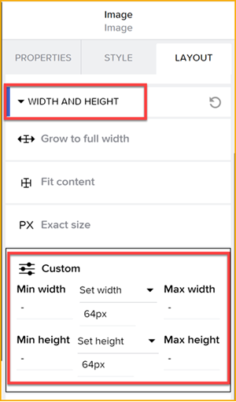

        >To select a value for many of the layout properties, click on the existing value (20%).
        
        >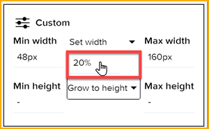

        >You will get a variety of options for entering the value: 

        >- **Theme:** A variety of predefined values
        >- **PX:** By entering a pixel value (no need to type `px`)
        >- **%:** By entering a percentage of the current container width
        >- **⚡:** By entering a formula

        >
        >
        >Since you want 64, enter `64` under **PX**.

    - Under **Position** (scroll down some more in the **Layout** tab), set the left spacing to **L 16px** (under **Theme**).

        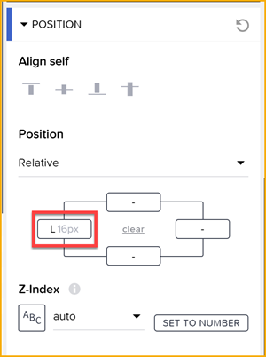
        
4. Click **Exit** to exit the Component Style Editor.

5. Click **Save** (upper right). 

    Once you click **Save**, if you have a tab where you previously opened a web preview of your app, that tab will automatically update – no need to go back to the **Launch** tab. Instead of opening up a new web preview, you can just navigate to that preview tab and see the updates.

    Navigate back to the preview tab, and you should see the app updated with the improved spacing.

    

   
    

