 


# 5 - Create a Business Process Project
<!-- description --> Create an empty business process to better understand how to release, deploy, and monitor processes, as part of the SAP Build CodeJam.


## Prerequisites

- You have completed the previous tutorial for the SAP Build CodeJam, [Write Logic to Maintain the Cart](codejam-04-add-to-cart).
  

## You will learn
- How to create a SAP Build Process Automation project
- How to create a Business Process that automates the Purchase Order Approval
- How to create Process Instance and Monitor it


## Intro

SAP Build Process Automation is a low code/no code tool under SAP Build Portfolio. With this tool, you will get access to a new range of opportunities for running your day-to-day workflows. In this tutorial, you will learn how to create a business process  using visual drag and drop simplicity.

There are many use cases/scenarios where you can bring about innovation using SAP Build Process Automation. In this tutorial, you will see how to create a Simple Business process flow for Purchase Orders Approval. We test the process flow by creating a process instance to make sure functionality works as expected.


### Create a process project

1. In the Build **Lobby**, choose **Create**.

    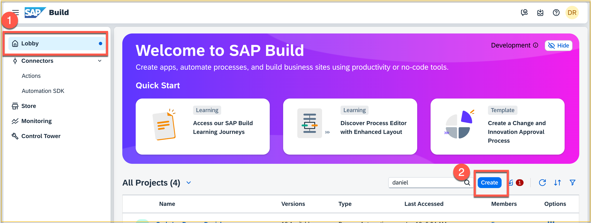 

2. Choose **Build an Automated Process**.

    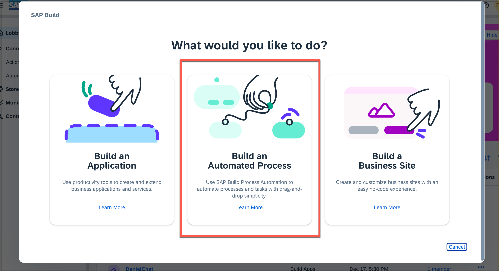 

    Choose **Business Process**.

    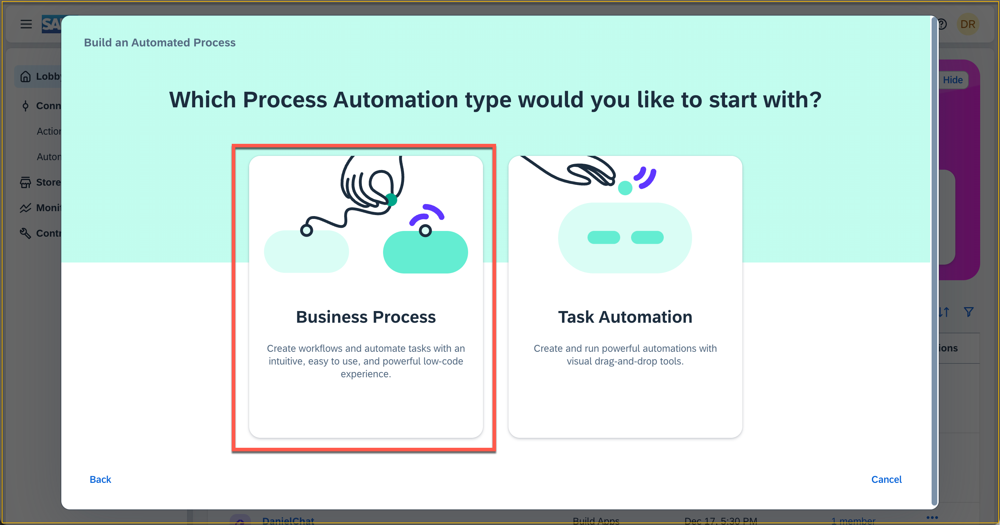

    In the Create a Business Process project dialog box, enter the following:

    | Field | Value |
    | ------ | ------ |
    | **Project Name** | `Purchase Approval` |
    | **Description** | `My purchase approval project`

    Click **Create**.

    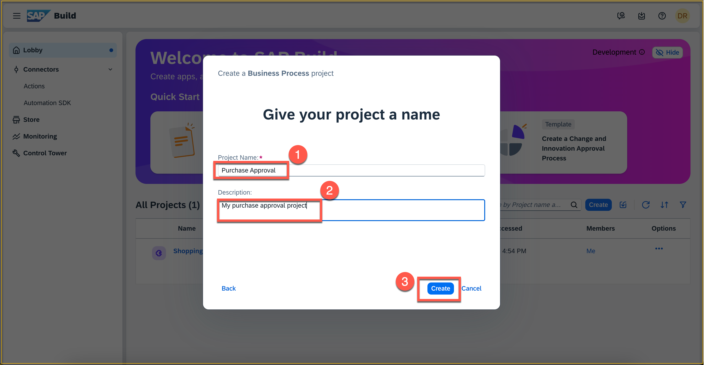

    >You may get a disclaimer screen. If so, click **Accept**.

    >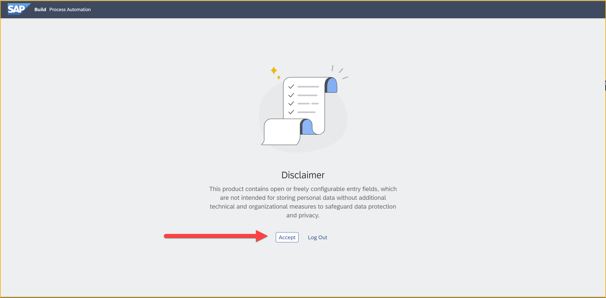

3. Once the project is created, it will automatically try to create a process for the project.

    In the dialog, for **Name**, enter `Purchase Approval Process`.

    Click **Create**.

    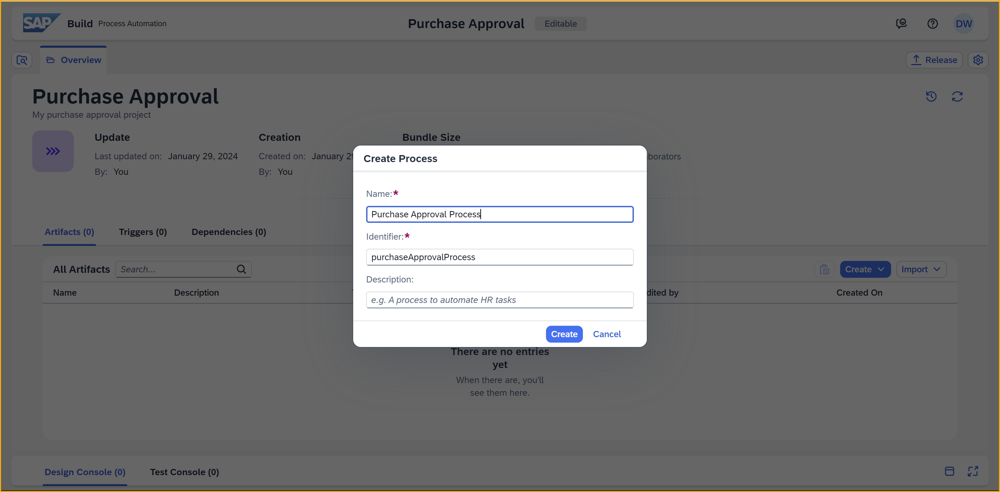 

    >You may get a message about the new layout editor or other news. Click **Close**.
    >
    >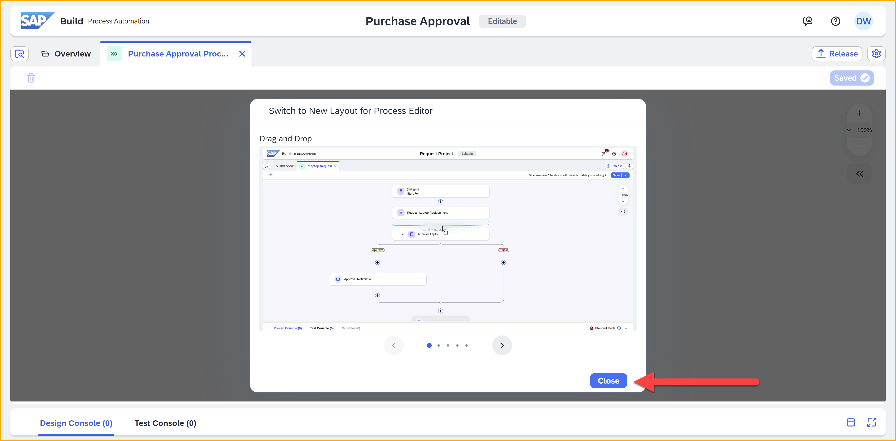

    In your project, you will see an empty process with start and end nodes.

    


### Configure the process inputs
A process makes decisions based on data sent to it when it is triggered (the process inputs), as well as data from API calls made as part of the process (actions).

In this step, you will specify the inputs required for the process.

>In later tutorials, you will create an action to get data from APIs.

1. Click the **Purchase Approval Process** tab.

    Expand the side panel. 

    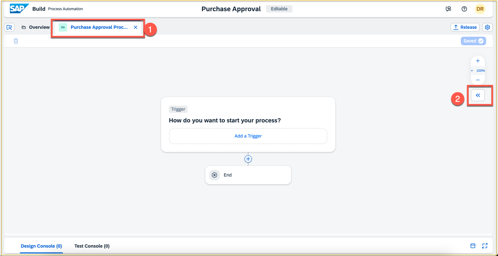

2. In **Process Details** (side panel to the right), click **Variables**.

    Next to **Process Inputs**, click **Configure**.

    

3. In the **Configure Process Inputs** window, click **Add Input** to add each input.

    

    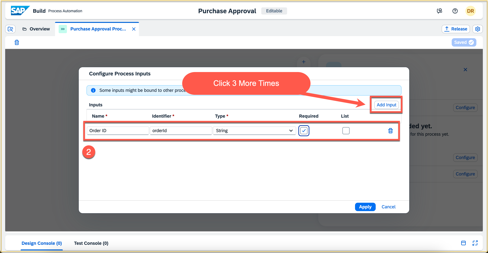

    Add the following inputs as shown in the above screenshot, flagging them all as **Required**.

    >The **Identifier** field values – which are case-sensitive – are auto populated. DO NOT CHANGE these.

    |  Field Name                | Type | Required |
    |  :-------------            | :------------- | :-------------
    |  `Order ID`                  | **String** | Yes |
    |  `Total`                  | **Number** | Yes |
    |  `Business Partner`          | **String** | Yes |
    |  `New Status`                | **String** | Yes |
  
    >The editor will remove leading and trailing spaces.

    After adding all the 4 inputs, the dialog should look like this.

    

    Click **Apply**.

    >**DOUBLE-CHECK** that you set the **Total** field as a number.

4. Click **Save** (upper right).

    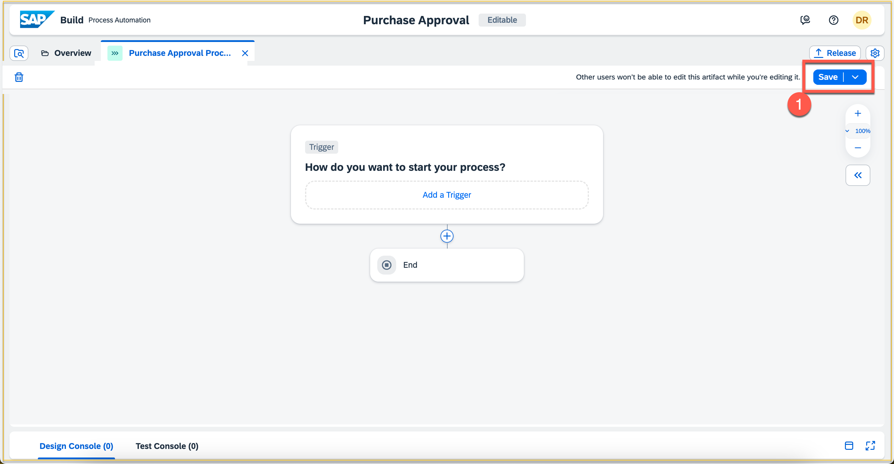


### Create API trigger
A business process is started by defining a trigger, an event that indicates to your SAP Build Process Automation to start an instance of this process.


>A process can be triggered in one of 3 ways:

>- **API:** SAP Build Process Automation defines a common API so that other apps can trigger processes.

>- **Event:** An event from SAP S/4HANA Cloud – via SAP Event Mesh – can be set up to trigger a specific process.

>- **Form:** You can build a form to give to your users that can be filled in and submitted to trigger the process. That form is created within the same project. Forms can also be built with SAPUI5.

For this process, you will define an API trigger, so our app can call an API to trigger it.

1. Click **Add a Trigger**.

    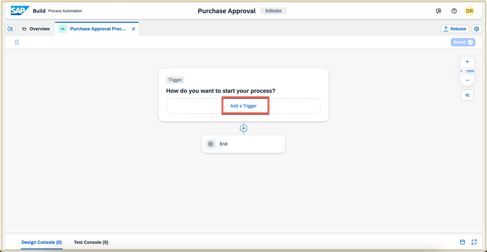

2. Choose **Call an API**.

    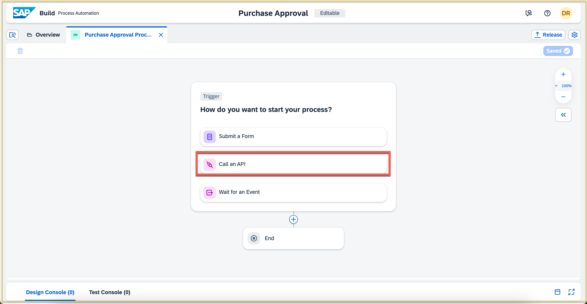

3. In the Create API Trigger dialog, enter `Purchase Approval Trigger` for the **Name**. 

    Click **Create**.

    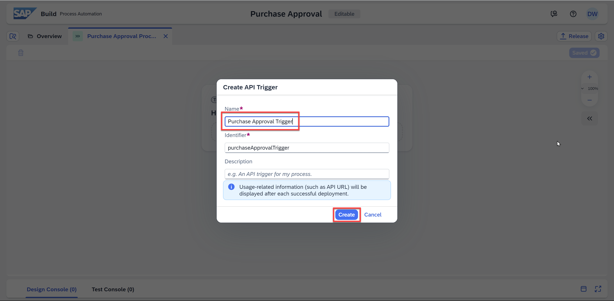

The process inputs are automatically added to the trigger. Click the **Trigger** block, and expand the side panel.

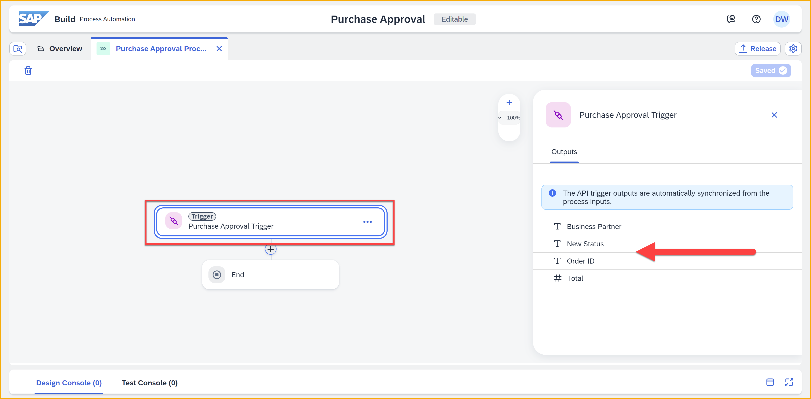

Note that API trigger's **Outputs** are automatically synchronized from the process inputs, meaning that the API will send these inputs and the rest of the process can use them.


### Release Project
To run the process, you must release and deploy it.

Releasing a project creates a version or snapshot of the changes and deploying the project makes it available in runtime to be consumed (or triggered). You can only deploy a released version of the project, and at a given time there can be multiple deployed versions of the same project.

1. Click **Release** (upper right).

    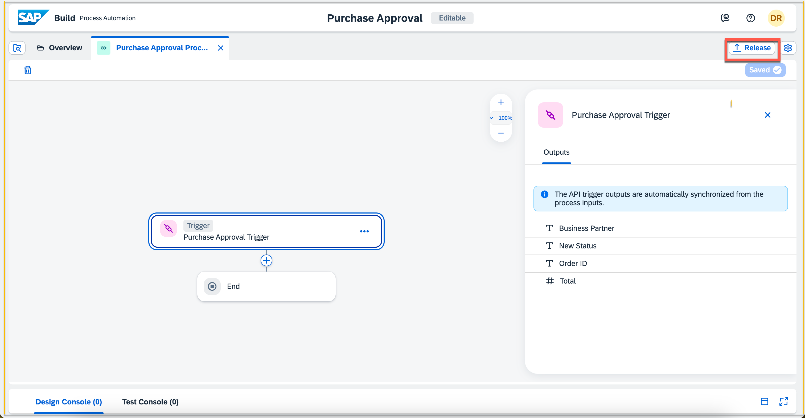

2. In the **Release Project** dialog, you can decide what type of change you are making, what version number to create, and a description of the changes in this version.
    
    However, the first time you release the project, it will automatically be set to 1.0.0, and you can only add a description.

    Click **Release**.

    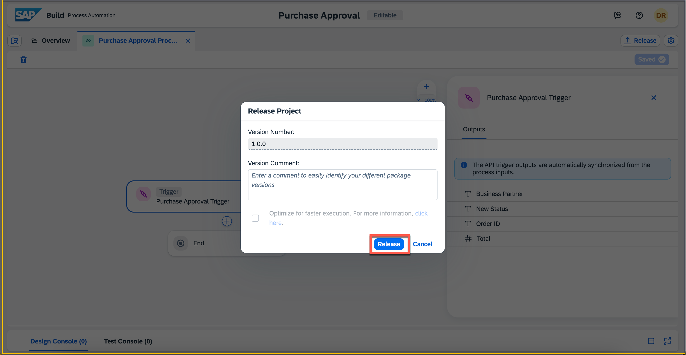

Examine the release status under the **Overview** tab. Make sure it is set to **Released**.


>From this dropdown you can view all the released and deployed versions of your project, as well as the latest version marked **Editable**. Whenever you need to make changes, make sure you have the **Editable** version.

>


### Deploy Project 

1. Once the project is released successfully, you will find a **Deploy** option on the top-right corner of the screen. 
   
    Click **Deploy**.

    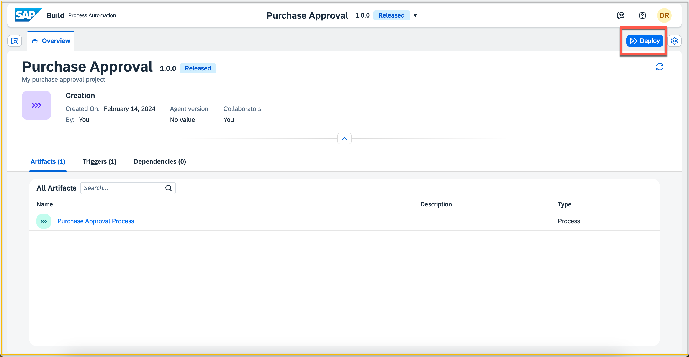

2. You will be asked to select an environment. Select **Public** and click **Deploy**.

    

    >SAP Build Process Automation enables you to create multiple environments with different security so you can control who can run and update processes. For this CodeJam, you will work with the default **Public** environment, which allows everyone to deploy processes to the environment and execute those processes.

    >For more information, go to the SAP Build lobby and then **Control Tower > Environments**, or see [Environments](https://help.sap.com/docs/build-process-automation/sap-build-process-automation/environments).

3. A dialog indicates the triggers to be created and deployed.
    
    Click **Deploy**.

    

    >Deploying will take a couple of seconds/minutes depending upon how big your project is and how many artifacts it has. Any errors during deployment are displayed in the **Deployment Console** at the bottom of the screen.

    Once the deployment is successful, the status will change at the top of the page to **Deployed**. 
    
    

4. Return to the SAP Build lobby by clicking SAP Logo in the top-left corner.

    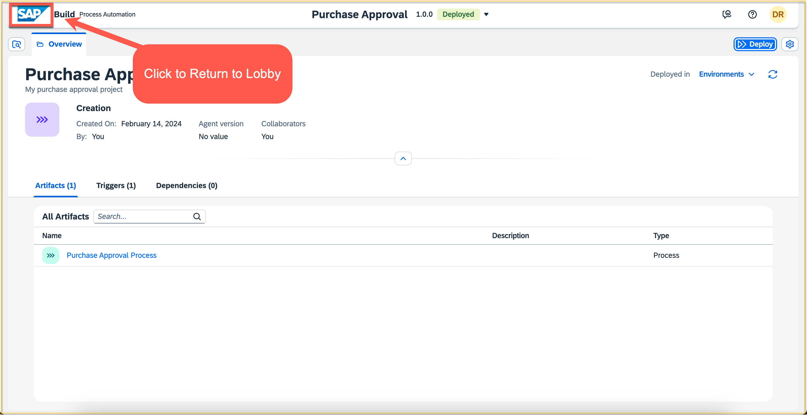


### Start a process instance
SAP Build Process Automation lets you trigger a process manually, generally so you can quickly test it.


1. In the SAP Build lobby, choose **Monitoring**. 

    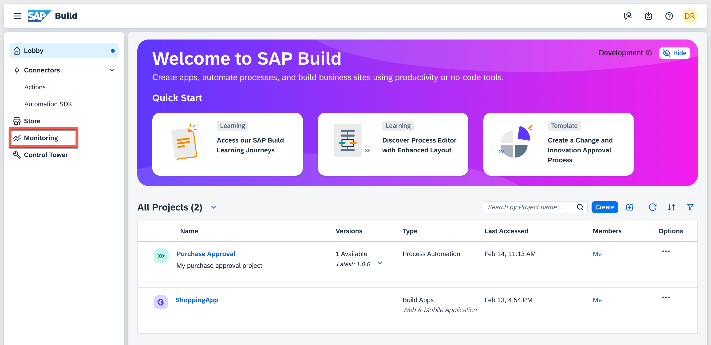

2. Under **Manage**, click **Processes and Workflows**.

    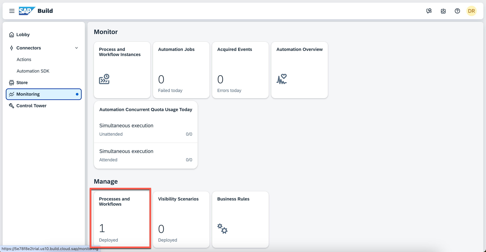

    This area shows you all the processes that have been deployed. If you are using SAP Build Process Automation for the first time in your trial account, there is only one process and it is already selected.

    If it isn't selected, select it.

    

    >For when you have many more processes, you can perform a free text search, or you can select the project and then see all the processes in that project.

    With the process selected, you will see information about the process, most notably:

    - Its **ID**. You will need this ID when you make an API call to trigger this process.

    - Buttons for showing all the instances of this process that were triggered, and for starting a new instance of the process.

    >**IMPORTANT:** Make note of the process ID.

4. Click **Start New Instance**.

    This opens a dialog that lets you trigger a process – for testing  – without using a form, API call, or external event.

    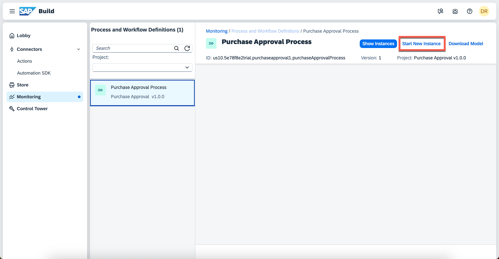

    A dialog opens that lets you provide the required inputs for the process, in JSON format.
    
    >**IMPORTANT:** You must provide the values for the inputs that you defined as "process inputs," in JSON format. BUT ... the example JSON you will see in the dialog is not related AT ALL to what you need to provide. Therefore, you will delete this JSON.  

    >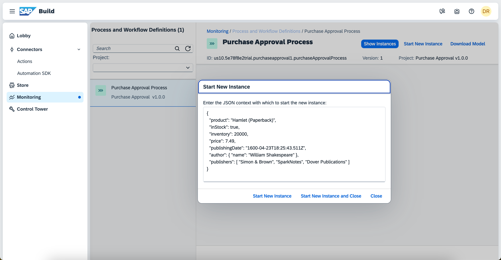

    Here's a reminder of the Process inputs you defined in the Process Editor (in the JSON, you must use the same field identifiers in the JSON key value pairs ):
   
    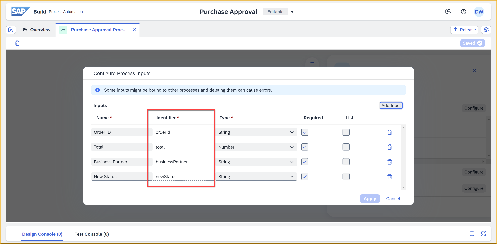

5. Delete the JSON in the dialog, and replace it with the following:

    ```JavaScript
    {
    "businessPartner" : "11",
    "newStatus" : "APPROVED",
    "orderId" : "100000",
    "total" : 1000 
    }
    ```

    

6. Click **Start New Instance and Close**.

    If all goes well, you will get the message **Instance started**.

    

    >If things didn't go well, you may get the following:
    >
    >
    >
    >This is most likely because the identifier names or the types of the input parameters defined in the process do not match the data you just entered to start the process – for example, you sent a number for a string input.
    >
    >One thing you may not have done is change the data type of the **total** input parameter to **Number**. If so, you must go back to the **Editable** version of your project, change the type for the **total** input, and release and deploy again. Or, you may have changed the identifiers for an input.


### Monitor the Process  
Once triggered, you can monitor the process instance from the **Monitor** section of the **Monitoring** tab.

1. In the same screen you triggered the process, click **Show instances**.
    
    

    >You can also get to the same place with the menu by clicking **Monitoring**, and under **Monitor** clicking **Process and Workflow Instances** (likely first tile on the page). 

    >You would then have to filter or search for your instance. The **Show Instances** button takes you there directly.


2. By default, completed processes are not shown in the list. And because you have no steps inside the process, it will start and immediately complete.

    To see your instance, in the filters, click the dropdown for the **Status** filter, and select **Completed**.

    Now you should see your process instance.

    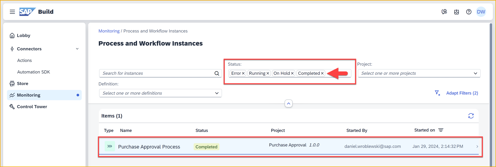
    
4. Click on your process instance.

    In the details section at the top, you can see:

    - When it started
    - When it completed
    - Who started it
    - ID of the instance
    - Definition ID of the process (this is the ID you need later)

    

    Under **Logs** you can see all the events that occurred, such as its triggering, approval forms completed, API calls performed, and any other action that was taken as part of the process.

    Under **Context**, you can see the data that was passed to the process, or that was retrieved during steps that involved data. 


**Congratulations!** You have created your first simple SAP Build Process Automation process.


