  


# Trigger Process from Your App
<!-- description --> Enable your app to call the SAP Build Process Automation API in order to trigger your process, as part of the SAP Build CodeJam.


## Prerequisites
- You have completed the previous tutorial for the SAP Build CodeJam, [Add Approval Flow to Process](codejam-06-spa-approval).


## You will learn
- How to create a destination for SAP Build Process Automation
- How to trigger a process from an SAP Build Apps application


## Intro
You have so far created an app to let users browse a product catalog and add items to their shopping cart. And you have created a process for approving the purchase.

Now you will connect the app to the process.


### Create destination for SAP Build Process Automation

To connect Build Apps to Process Automation a destination needs to be created for the Build Process Automation from the SAP BTP Cockpit.


1. Go to your SAP BTP cockpit, enter your **trial** subaccount, and on the left select **Instances and Subscriptions**.
   
2. Under **Instances**, find your instance of the SAP Build Process Automation service.

    

    On the right, click the three dots, and then select **Create Service Key**.

    <!-- border -->
      

3. Enter the name for service key as `spa-key` and choose **Create**.

    <!-- border -->
      

4. The service key is created and you can view the credentials.

    <!-- border -->
    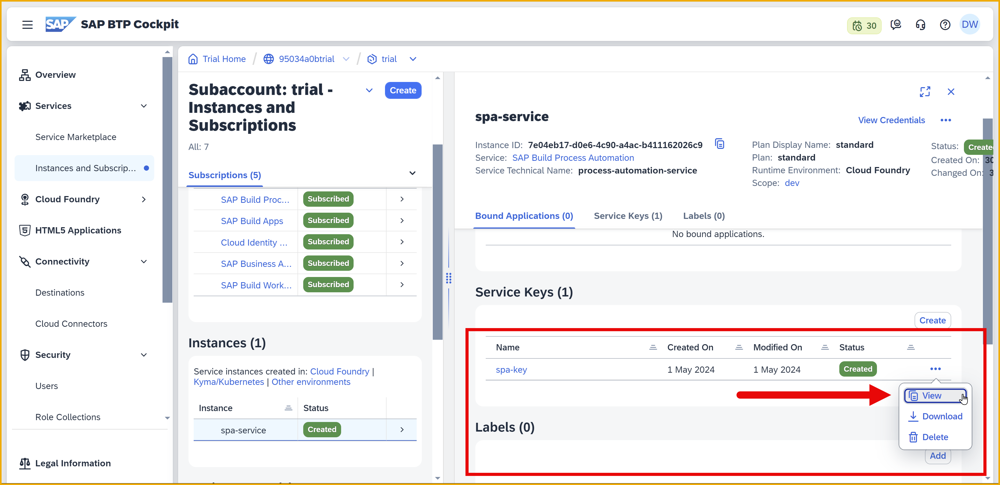  

5. After the key is provisioned, open it and take note of the following fields, or just save the entire text to a file:

    - **api**
    - **clientid**
    - **clientsecret**
    - **url**

    These values are needed next for the **Destination Configuration**.

    <!-- border --> 

6. Download the destination definition.
   
    Click [`spa_process_destination_USER`](https://github.com/sap-tutorials/sap-build-apps/blob/main/tutorials/codejam-07-connect-app-process/spa_process_destination_USER), and then click the download button.

    

7. In the SAP BTP cockpit, click **Connectivity >  Destinations**.

    <!-- border -->
    

8. Click **Import Destination**, and then select the `spa_process_destination_USER` file you downloaded.

    <!-- border -->
    

    The draft destination will be filled in except for the credentials and URLs.

    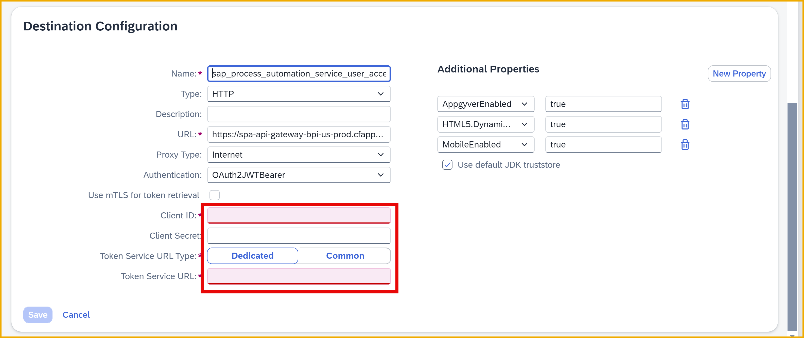

9. Enter values for the following fields, based on the service key information you saved earlier. For **api** and **url**, you will have to append some text.

    | Destination Field | Value from Key |
    |--------------------|--------------|
    | URL | api + `/public/workflow/rest/v1/workflow-instances` |
    | Client ID | clientid  |
    | Client Secret | clientsecret  |
    | Token Service URL | url + `/oauth/token`  |

    Select **Use default JDK truststore**.

    Click **Save**.


 


### Create data resource for triggering process
Now that we defined the API for triggering the process, we need a data resource so we can call the API from SAP Build Apps.

1. Open your SAP Build Apps project from the SAP Build lobby.

2. Open the **Data** tab.

3. Under **SAP Build Apps classic data entities**, click **Create Data Entity > SAP BTP Destination REST API Integration**. 

    

4. In the **Base** tab, configure the following:

    | Field | Value | 
    |-----|-------|
    | **Data entity name** | `Trigger Workflow` | 
    | **BTP destination name** | **sap_process_destination_user** | 

    

    To the **Resource schema**, add the following fields (use the same name for the field name and key):

    | Field | Type | 
    |-----|-------|
    | **orderId** | Text | 
    | **total** | Number | 
    | **newStatus** | Text | 
    | **businessPartner** | Text | 
    | **orderItems** | List, and List Type is Object | 

    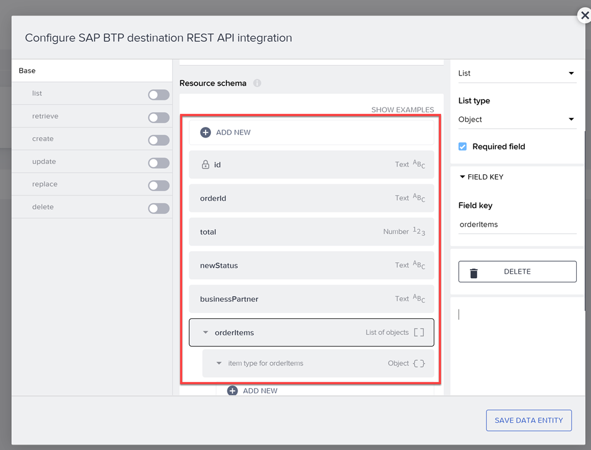

    Under **orderItems**, use **Add New** button to add the following subfields:

    | Field | Type | 
    |-----|-------|
    | **price** | Number | 
    | **total** | Number | 
    | **product** | Text | 
    | **quantity** | Number | 
    
    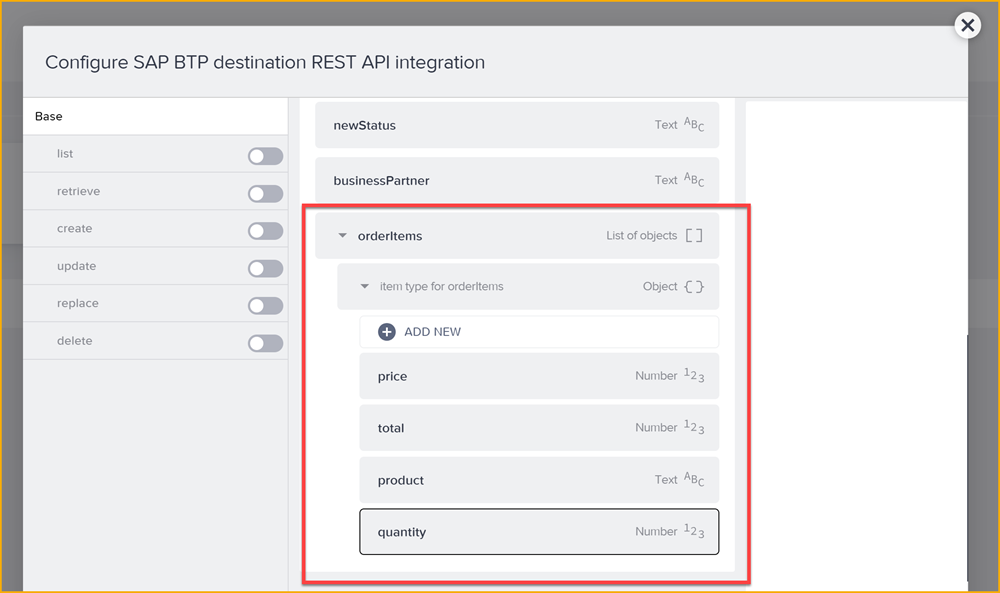

5. Click the **Create** operation, and toggle the switch on.

    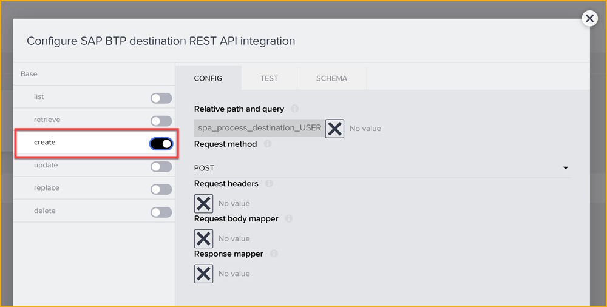

    Under **Request headers**, click the **X**, then select **List of values** and then **Add a value**. Add the following header:

    | Header Name | Header Value | 
    |-----|-------|
    | `Content-Type` | `application/json` | 

    Click **Save**.

    

    Under **Request body mapper**, click the **X**, then select **Formula** and use the following formula. Replace `<your definition ID>` with the ID for your process.

    ```JavaScript
    ENCODE_JSON({  "definitionId": "<your definition ID>",  "context":  query.record })
    ```

    

    >If you did not save your definition ID, go to the SAP Build lobby, and go to **Monitoring > Manage > Process and Workflows**, and click your process.

    >On the right you will see the **ID**. This is the definition ID you need. 

    >

    Your **Create** operation should look like this:

    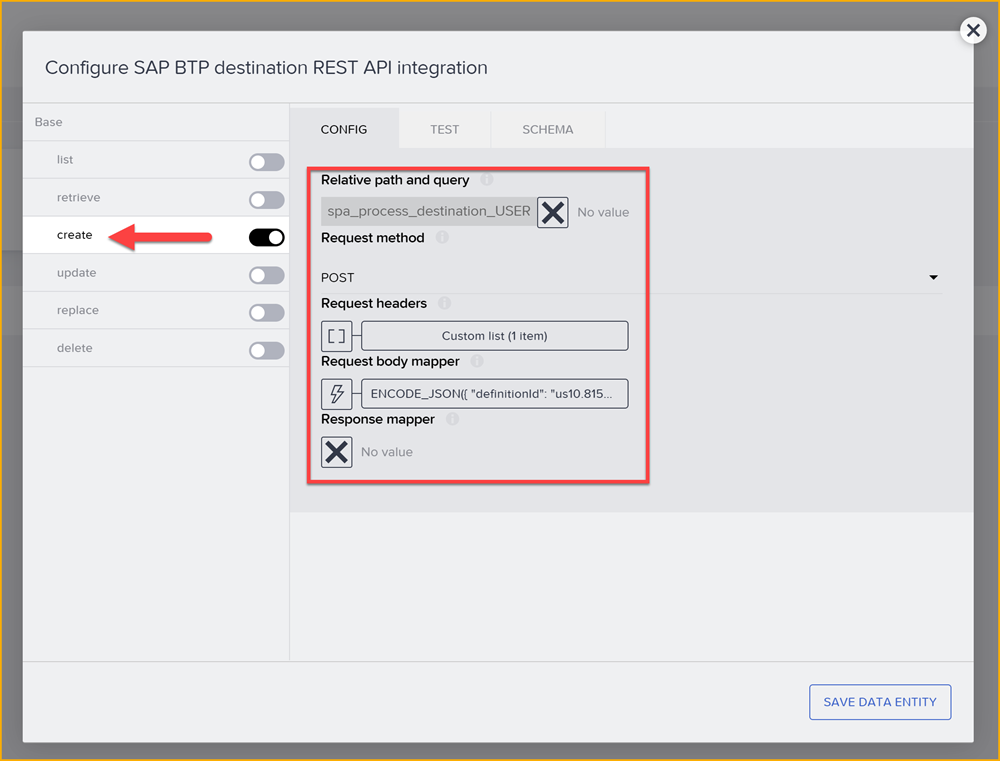


6. Save your work by clicking **Save Data Entity**.

    Click **Save** (upper right).


### Test the trigger
1. Open the data resource again by clicking the **Trigger Workflow** tile.
   
    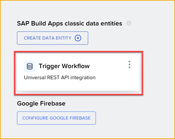

2. Click **create** on the left, and then the **Test** tab.

    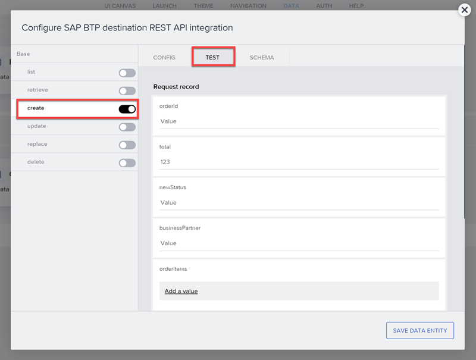

3. Enter the following values for the fields.

    | Field | Sample Data |
    |-------|--------------|
    | **orderId** | `6c25e827-15c2-1111-be1a-89fb4304d4fa` |
    | **newStatus** | `CART` |
    | **businessPartner** | `1234567` |
    | **total** | `1200` |

    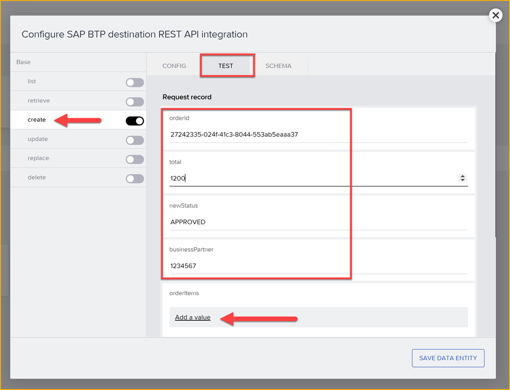

    And create one order item by clicking **Add a value** under **orderItems**, and here's example data:

    | Field | Sample Data |
    |-------|--------------|
    | **price** | `9.99` |
    | **total** | `19.98` |
    | **product** | `Headphones` |
    | **quantity** | `2` |

    >SAP Build Process Automation expects numbers as numbers, not strings. If you do not enter a value for a number field, a blank string is sent and an error occurs.

    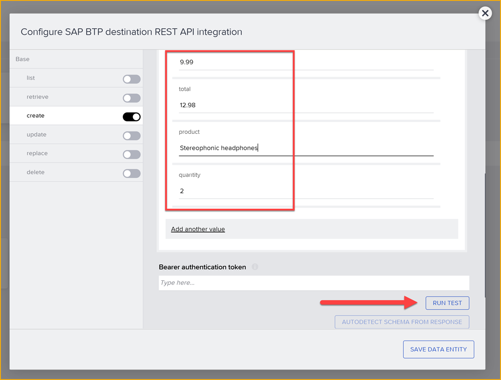

4.  Click **Run Test**.

    If all works OK, you will get a **201** status code and a response with information about the process instance you just triggered, something like this:

    ```JavaScript
    {
    "id": "54988e48-8056-11ed-9a13-eeee0a99244a",
    "definitionId": "us10.my-account.salesorderapprovals.orderProcessing",
    "definitionVersion": "6",
    "subject": "PurchaseApproval",
    "status": "RUNNING",
    "businessKey": "54988e48-8056-11ed-9a13-eeee0a99244a",
    "parentInstanceId": null,
    "rootInstanceId": "11118e48-8056-11ed-9a13-eeee0a99244a",
    "applicationScope": "own",
    "projectId": "us10.my-account.salesorderapprovals",
    "projectVersion": "1.0.5",
    "startedAt": "2022-12-20T11:06:19.318Z",
    "startedBy": "sb-clone-41c25609-33a1-9999-97d8-34fcd2316008!b3591|workflow!b116",
    "completedAt": null
    }
    ```

    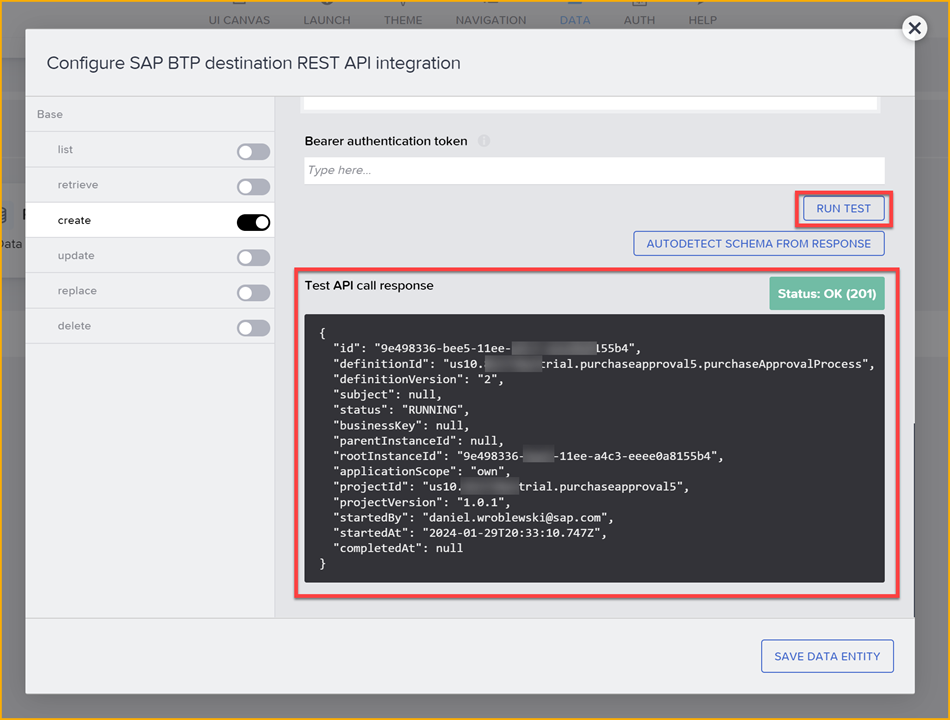

    Click **Save Data Entity** to close the data resource definition.

> **COMMON ISSUES**
>
>**403:** The destination to the SAP Build Process Automation API is not configured properly. Make sure the client ID, secret, service URL and authentication URL (with `/oath/token` path) are set correctly. Do not add user/password for the authentication URL.
>
>**404:** The API did not recognize the name of your process (i.e., `definitionId` in the request body mapper) or the path to the service is wrong -- both in the **create** tab.
>
>**415:** You did not send the `Content-Type` request header.
>
>**422:** This basically means that the API heard your call but it didn't like something in the request body.
>
>- The format of a field may be wrong, for example, text for a number field or an invalid date format (dates must be in this format: `2023-01-31`). 
>
>**500:** This may mean that your URLs are wrong, especially, you may have the wrong URL for OAuth authentication, such as you forget to add the path `/oauth/token`.
>
>Note that field names are case sensitive. This will not cause an error in the API call, but the values will not be passed to the workflow properly and you will not see the values in the workflow forms.

If you've gotten to here, your integration with SAP Build Process Automation is working!!

You can go into the SAP Build Process Automation monitoring and see there the process you just triggered, and check the context to make sure the parameters were sent properly.

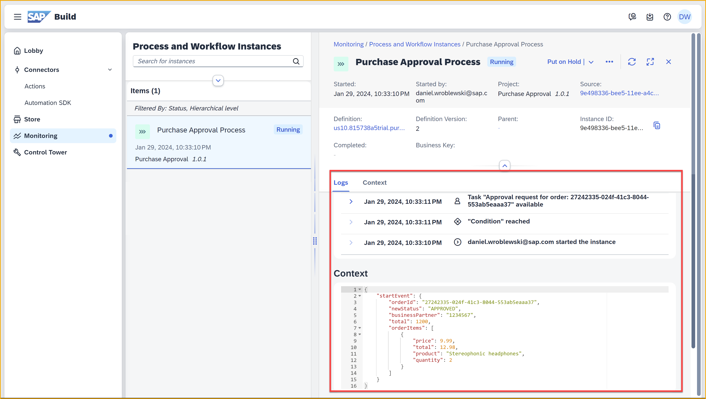

You can also check the Inbox to see the that the approval form was created properly – you get an approval form because the total was over 1000.

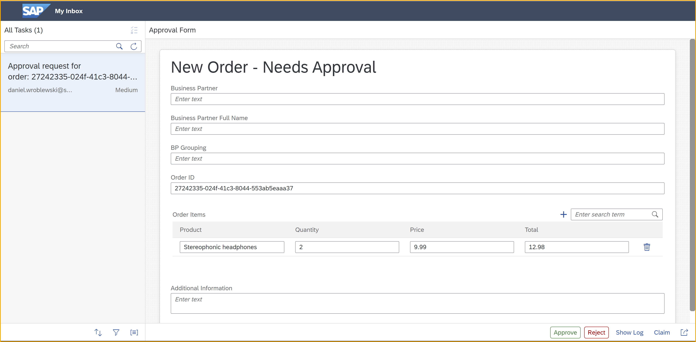

Close your data resource definition by clicking **Save Data Entity** on the `Configure SAP BTP destination REST API integration` pop-up.


### Add purchase logic
Now that we have the data connection for triggering our process working, we now want to add logic so it will occur when we click purchase in our app for our cart of items.

1. Open the **Cart** page.

    Go to the **UI Canvas** tab.

2. Click on the **Purchase** button, and open up the logic canvas for the button (click **Show logic for Button - Trigger Workflow** at the bottom of the page).

    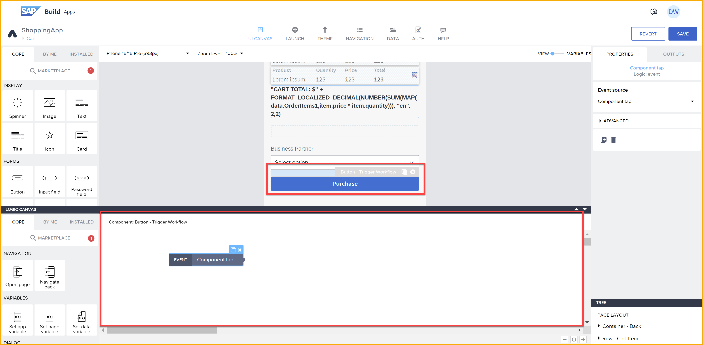

3. Add a **Create record**, **Update record** and **Alert** flow function, and attach them as follows:

    

4. Configure the **Create record** as follows:

    - **Resource name:** Set to **Trigger Workflow**.

    - **Record:** Click **Custom object** and set the fields as follows:

        - **orderId:** Set to **Date and Variables > App variable > orderID**
        - **newStatus:** Set to `APPROVED`
        - **total:** Set to the following formula:

            ```JavaScript
            SUM(MAP(data.OrderItems1,item.price * item.quantity))
            ```

        - **orderItems:** Set to to the following formula:

            ```JavaScript
            MAP(data.OrderItems1, {product: item.product, price: item.price, quantity: NUMBER(item.quantity), total: item.price * item.quantity})
            ```

            >We use a formula because we have to modify the data slightly before sending. Specifically, the quantity from the input box component is a string and we need to convert it to a number.

        - **businessPartner:** Leave empty for now

        Click **Save**.

5. Configure the **Update record**, which is called to change the status of the order and set its total field, as follows:

    - **Resource name:** Set to **Orders**.

    - **ID:** Set to **Date and Variables > App variable > orderID**

    - **Record:** Click **Custom object** and set the fields as follows:

        - **status:** Set to **Static text** with value `REQUESTED`
        - **total:** Set to to the following formula:

            ```JavaScript
            SUM(MAP(data.OrderItems1,item.price * item.quantity))
            ```
        
        Click **Save**.

6. Configure the **Alert** by setting the **Dialog title** to **Output value of another node > Create record > Error > message**.

    Click **Save**.

7. Click **Save** (upper right).


### Add reset logic
In the same logic for the button, we want to:

- Alert the user that the purchase was successful
- Reset the cart ID (since it cannot be used anymore)
- Reset the items in our data variable.
- Go back to the home page

Update the logic as follows.

1. In the same logic for the button, add these additional flow functions and connect them as shown:

    

2. Configure the **Alert** by setting the **Dialog title** to `Order requested. Returning to Home Page.`.

3. Configure the **Set app variable** as follows:

    - **Variable name** to `orderID`.

        Leave the **Assigned value** blank.

4. Configure the **Open page** as follows:

    - **Page** to `Home page`.

5. Click **Save** (upper right).

>There is no need to do anything for the **Set data variable**, since the data variable is automatically set to **OrderItems** since it is the only data variable for this page. And since we want to blank it out, the **Record collection** can be left as set to nothing.


### Test app
1. Run your app again (see the **Launch** tab).
   
2. In the navigation bar on the left, click **Cart**.

    >You should already have something in your cart. If not, go back to the home page and add something to your cart.

    >No need to select a business partner.

3. Click **Purchase**.

    If all goes well, you should get a confirmation box.
    
    

3. Now go back to the **Monitoring** tab and you should see that your app started an instance of your process.

    And if it is over 1000 for the total, it will set off the approval form.

    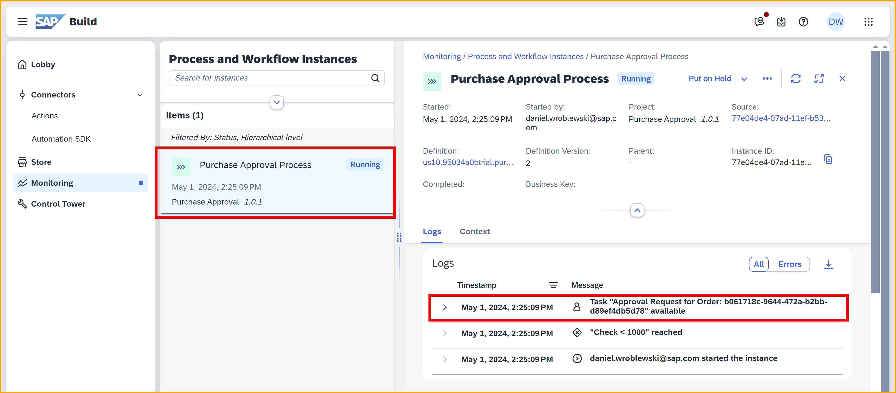

    Pretty cool, no?

    Now go to your inbox, and you see a new approval form, this time with your orderID in the title.

    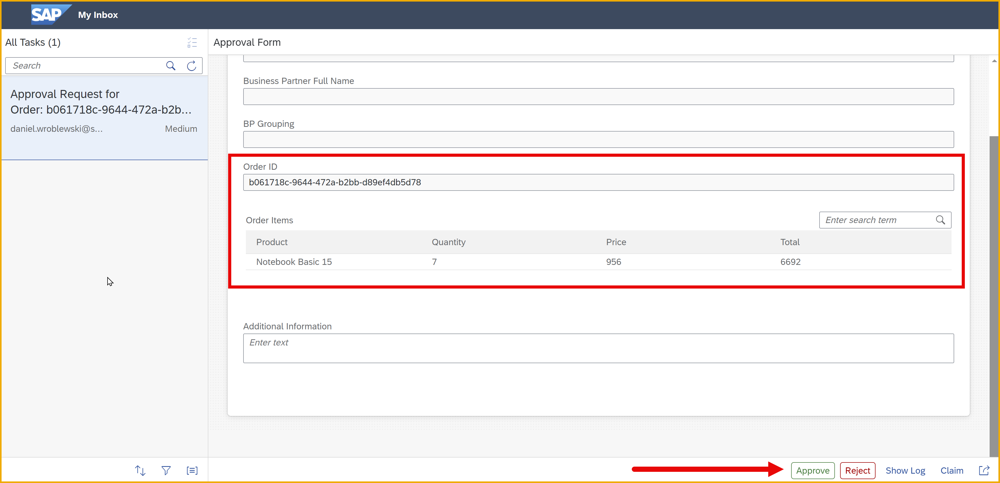

    In the form itself, you'll see the order ID and the order items.

    Click **Approve** (the form should disappear), and then refresh the list of tasks. Now you should see the approval notification, with the same order ID. 

    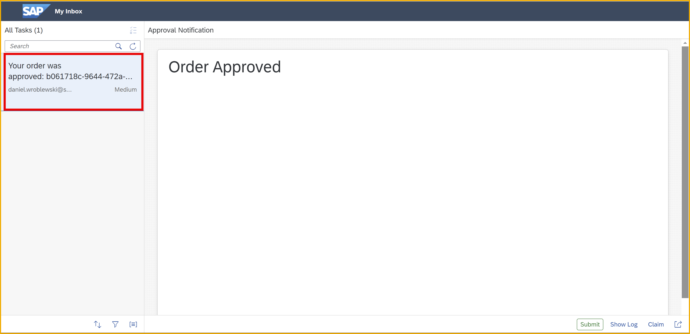