  

# 9 - Create Action Project to Post Data to CAP Service
<!-- description --> Create an action project to update our CAP service and call the action from your process when the order is approved, as part of the SAP Build CodeJam.


## Prerequisites
- You have completed the previous tutorial for the SAP Build CodeJam, [Create Action to Get Data from SAP S/4HANA Cloud](codejam-08-action-get).


## You will learn
- How to create an action to update data
- How to use an action in your process


## Intro
In the previous tutorial, you created and used an action to retrieve data from an SAP S/4HANA Cloud system.

In this tutorial, you will create another action, this time to connect to our CAP service and update an entity.


### Enable destination in processes
SAP Build Process Automation enables administrators to control which destinations – and, therefore, which backend systems – can be connected to processes during runtime. 

You already created the destination for the CAP service because you needed it in the app. In this step, you will enable the destination to be used in your process.

1. Go to the SAP Build main page.

2. Go to **Control Tower**, and then click **Backend Configuration > Destinations**.

    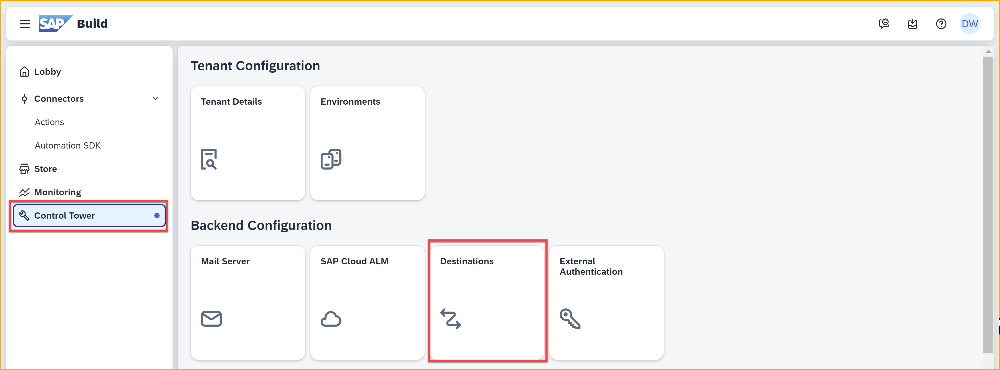

3. Click **Add**.

    

    Select your destination, **CodeJamOrdersService**.

    Click **OK**.

    

    The destination will be added to the list of destinations that can be used within your processes for runtime.


### Create action project

1. Go back to the SAP Build lobby, and click **Connectors > Actions**.

    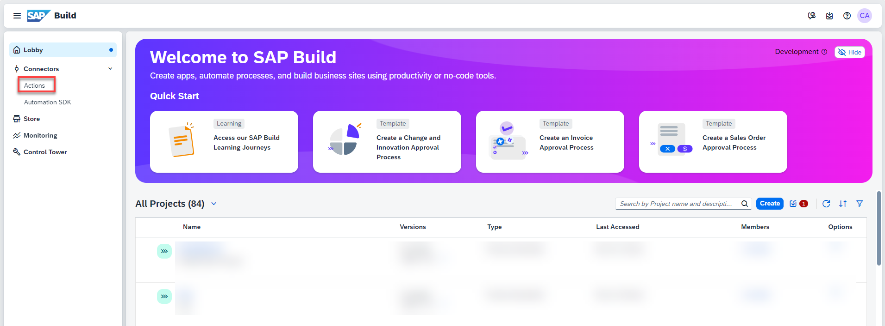

2. Choose **Create**.

    

3. Select **Live API > OData Destinations**.
   
    

    Select **CodeJamOrdersService**.

    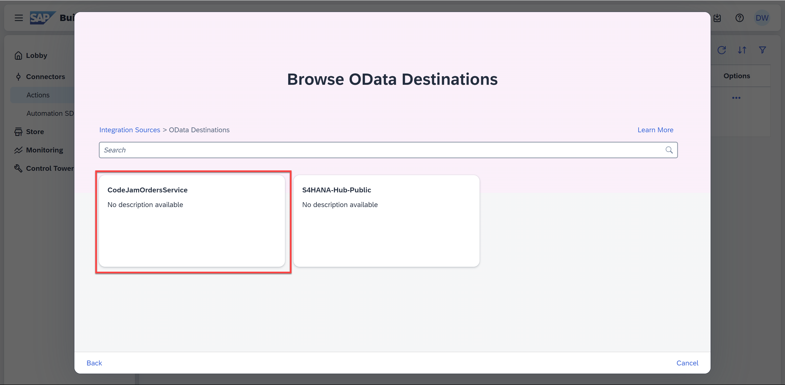
    
    >CodeJamOrdersService was already configured as a destination in the SAP BTP cockpit – with the additional property `sap.applicationdevelopment.actions.enabled` – and hence is visible here.

    After selecting the destination, you will see a list of all the entities and all the API calls you can make.

    Click **Next**.

4. Enter `OrderManagement-Actions` for the project name and description.
    
    Click **Create**.

    

    You will now see the operations available for this service, and you will need to decide which ones to expose.

5. In the **Orders** entity, you want to only update the **status** field. Hence, in the popup, you have to select the **PATCH** method of **/Orders({ID})** API. 
    
    Select the **Filter actions** dropdown, filter option and choose **PATCH**. 
    
    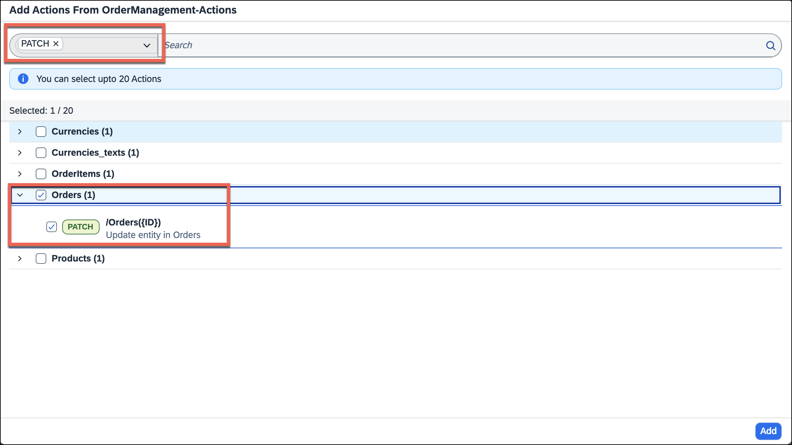

    Now, under **Orders** there will appear just one API. Select it.

    >SAP Build Actions will open with the selected APIs. You can always go back and add additional APIs to expose.

    Click **Add**.

    The PATCH method to update the Orders entity is now selected and the action project is saved.

    


### Test action
Let's make sure everything is connected properly and test the action.

1. Click the **Test** tab.

    Under **Connectivity > Destination**, select the destination **CodeJamOrdersService** from the dropdown options.

    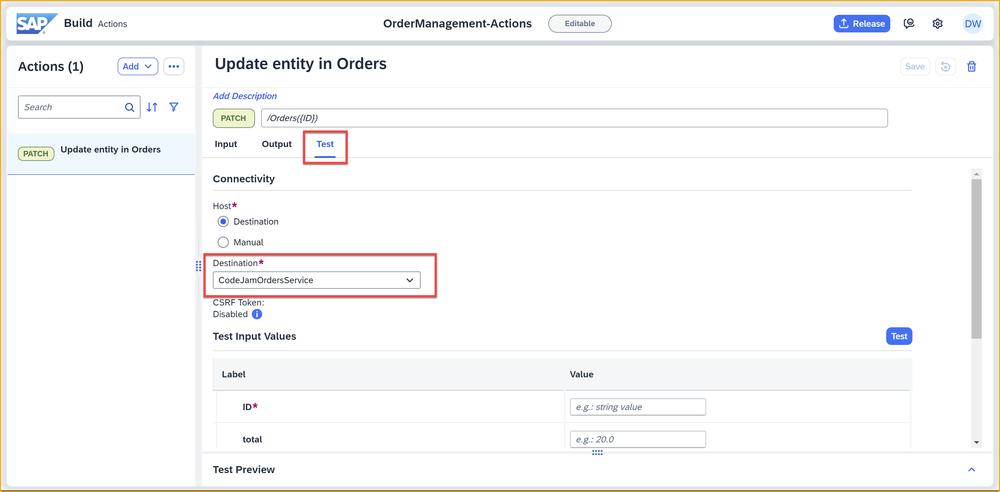

2. Under the **Test Input Values**, enter `6c25e827-15c2-4e7f-be1a-89fb4304d4fa` for the **ID** field.
   
    
   
3. Click **Test**.

    Once the execution is successful, you should see **200: OK** response.

    No data was changed since we did not supply any values for any of the fields.

    >If for some reason you entered an order ID that did not exist, the service will create it, and you will get a **201: OK** status code.

    >If for some reason you entered a value that was not a GUID, you will get **400: BAD REQUEST** or **404: NOT FOUND** status code.


### Release and publish action
You will now release the action project to create a version and then publish this version in the action repository. It is these published action that you will connect to from your process.

1. Click **Release** (top right).

    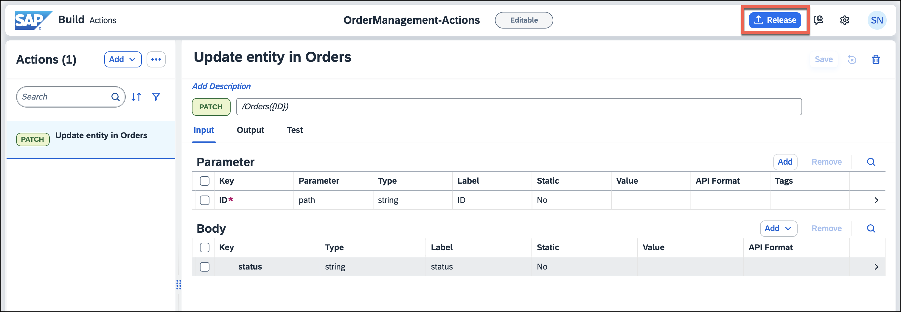

2. In the release popup, enter the **Release Notes** of your choice.

    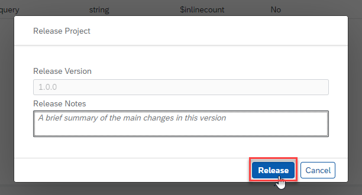

    >You have the option to enter release notes.

    Click **Release** again, to confirm.

    Notice the label has changed to **Released**.
    
3. Click **Publish to Library** (top right).

    

    Click **Publish** to confirm.

    After publishing the actions project, notice the label has changed to **Published**.

    


### Add action to process

You have already set up the approval form as part of the tutorial [Add Approval Flow to Process](codejam-06-spa-approval). 

Now, you will add the action so that if the order is approved, the action will update the status of the order.


1. Go back to your **Purchase Approval** project, and open the process.

    Make sure the **Editable** version is selected.

    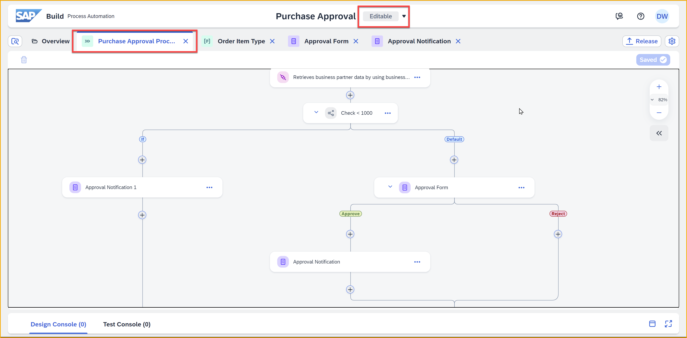

2. Click on the plus sign, **+** below the **Approval Notification** form.

    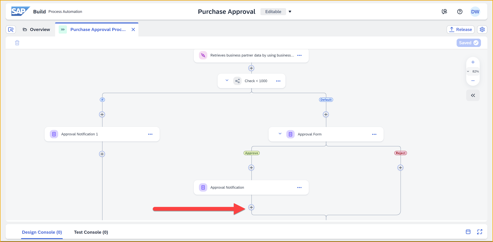

    In the pop-up, choose **Action**.

    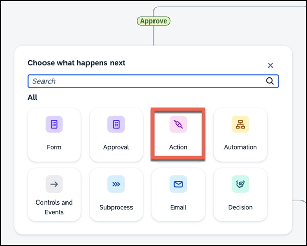

3. In the **Browse library** pop-up, filter by the **OrderManagementService** action project.

    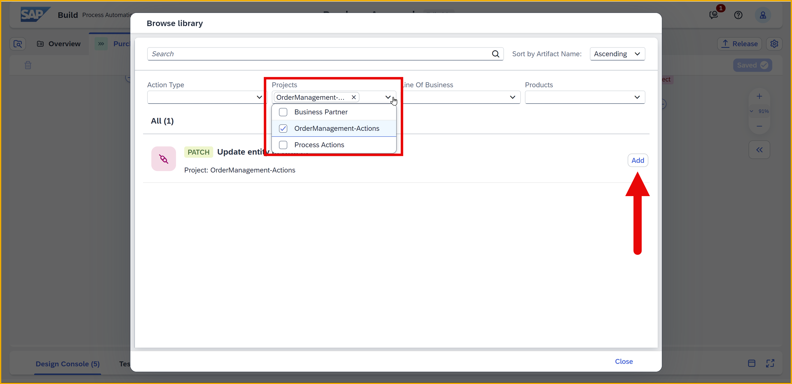

    Click **Add** next to the **Patch** API.

    The action gets added and a side pane opens.

    

    >You will see a red warning icon. This is only because you still need to bind data to the action, for example, the order ID.

4. In the side pane, click the **Destination variable** dropdown, and choose **Create Destination Variable**.

    >A destination variable creates a way that you can deploy your process to different systems – dev, test, production – and assign different destinations for this action to each environment, without having to change the process itself. 

    
    
    Enter **MyCAPDest** in the **Identifier** field, and click **Create**.

    >Destination variable identifiers cannot have spaces.

    


5. In the side pane, go to the **Inputs** tab.

    Click in the **ID** field (this is one of the inputs defined in the action). You must bind which order to update.
    
    Choose **Process Inputs > Order ID**.

    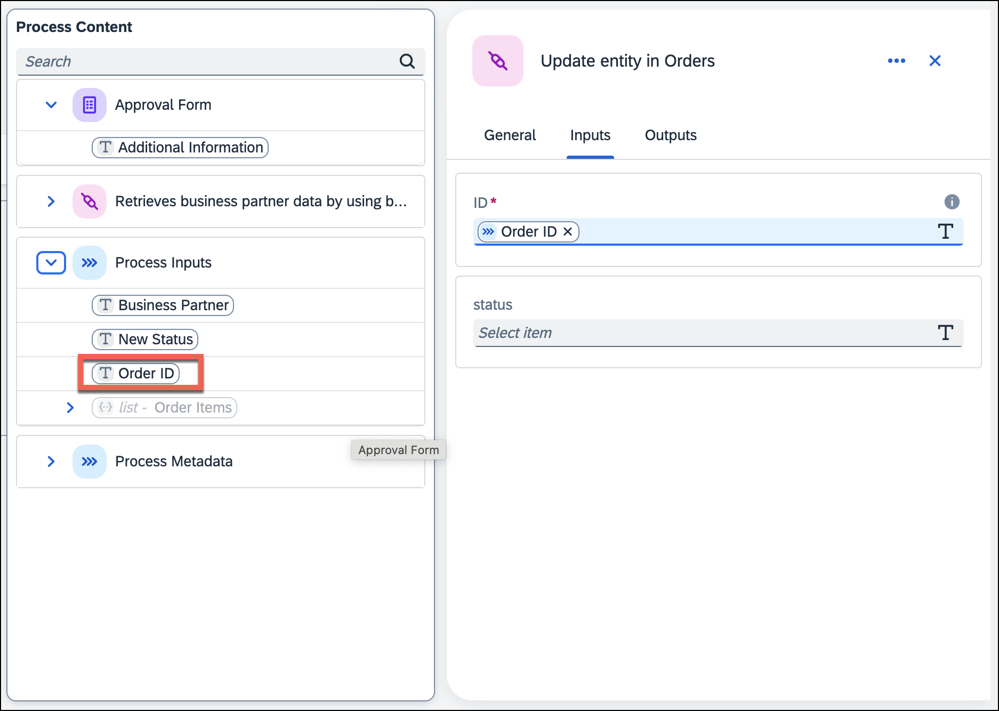

    Click in the **status** field, and then choose **Process Inputs > New Status**.

6. Let's do one more thing to make the process more efficient.

    You updated the CAP service to change the status of our order when an approver approves the purchase. But you also want to update the order status when it is automatically approved.
    
    Under the **Approval Notification 1** form, click the plus sign, **+**.

    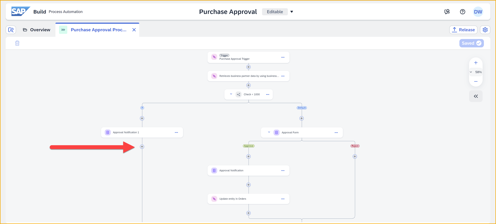
    
    Select **Controls and Events > Go-to-Step**.

    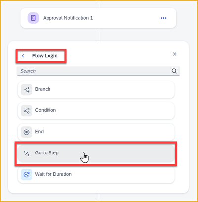

    Select the **Update entity in Orders** step.

    

    Your process flow is update.

    

7. Click **Save** (upper right).


### Release, deploy and publish process

1. Click **Release** (top right).

    

    In the pop-up, for **Release Notes**, enter `Added Action to update Orders entity`.
    
    Click **Release**. 

    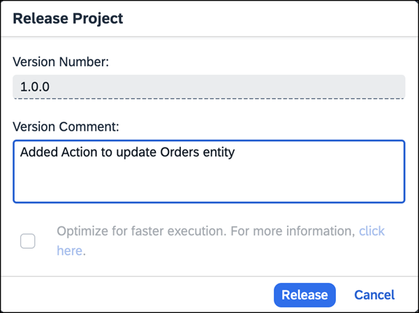

2. Click **Deploy**.

    Select the **Public** environment, and click **Upgrade**.

    

    The triggers that will be deployed will be displayed. There is nothing to do here but confirm.
    
    Click **Deploy**.

    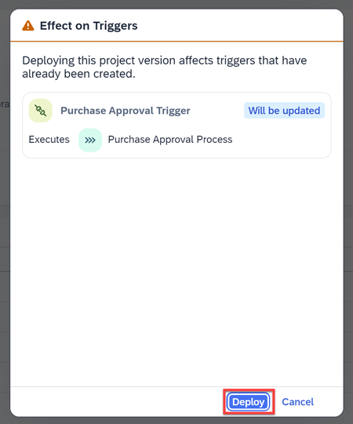

    Now you will see the environment variables for which you need to provide values. 

    

    Select the destination you created for accessing SAP S/4HANA and for the CAP service.

    Click **Deploy**.

    The status of the project changes to **Deployed**. Click the SAP logo at the upper left to return to SAP Build Lobby.

3. Go back to the SAP Build lobby, refresh the page.

    Next to your process project, click the 3 dots and select **Publish to Library**.

    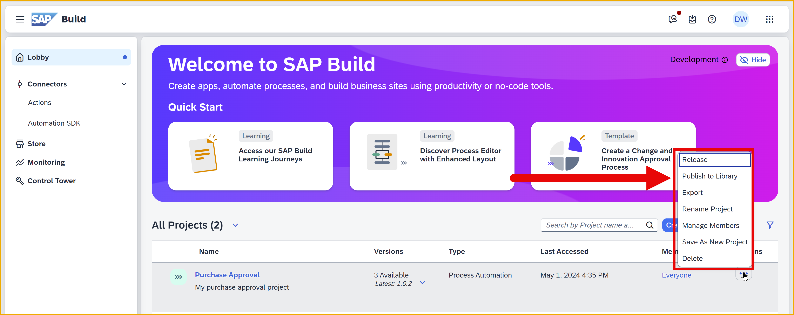

    In the dialog, click **Publish**.


### Build My Orders screen
In order to better see the status of all my orders and cart, you will create in 5 minutes a page for checking the status of your orders.

1. Open your SAP Build Apps project.

2. Open the **My Orders** page. 

    

3. Click **Marketplace**, and search for `basic table`.

    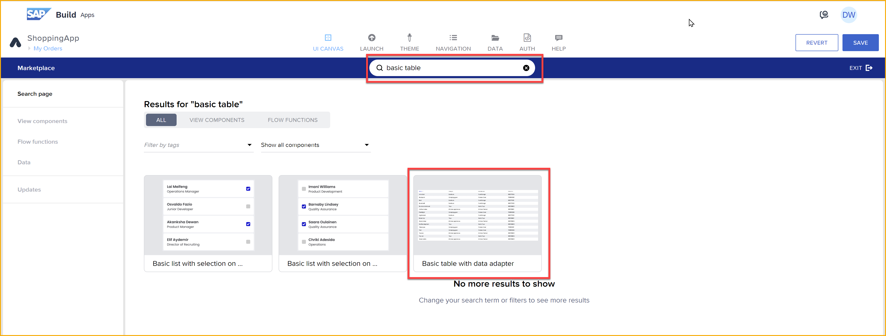

    Select the basic table, and click **Install**.

4. On the UI canvas, under the **Installed** tab on the left, drag an instance of the basic table onto the canvas.
    
    

5. In the **Properties** pane on the right, click **Configure**.

    Select **Orders**.

    

    Click **Properties**, expand the **Optional** node.
    
    Click the **X** next to **Filter conditions**.

    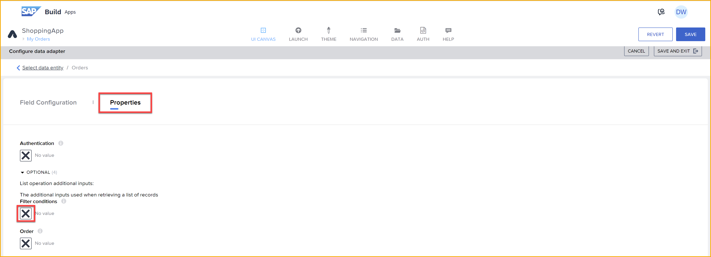

    Select **Object with properties**, then **Add Condition**.

    Set a condition where **customer** is equal to the following formula:

    ```JavaScript
    systemVars.currentUser.email
    ```

    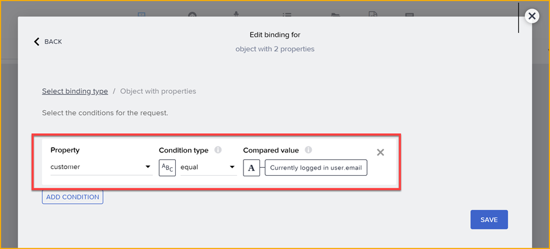

    Click **Save** twice.

    Click **Save and Exit** (top right.)

6. Click the **Navigation** tab.

    Click **Add Item**, and set the new item to the following.

    | Icon    |   Tab name  |   Page  |
    | --- | --- | --- |
    | `credit card`    |   `My Orders`     | `My Orders` |

7. Click **Save** (upper right).


### Test the app

1. Go into your app, select the **Notebook Basic 18**, and add it to your cart.

2. Go to the **My Orders** page and you will see your cart.

    

3. Go to the **Cart** page, and you will see your cart with the item you just selected.

    Select the business partner **100000**, and then click **Purchase**.

    

    The cart is sent to the process to be approved.

    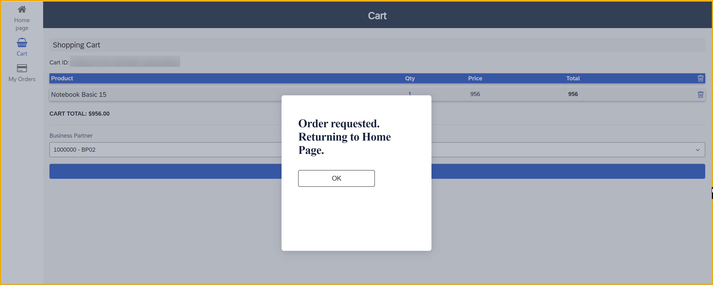

4. Go back to the **My Orders** page, and you will see that your cart now has a total – 1570 – and its status is now **REQUESTED**.

    

5. Open your Inbox, and you can see the approval form.

    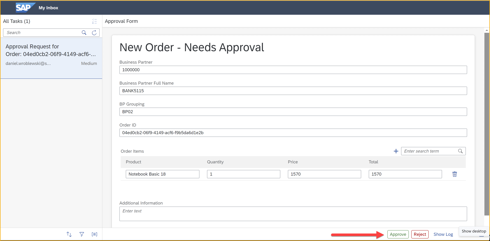

    Click **Approve**. The form disappears. Refresh the Inbox and you should see the notification form.

    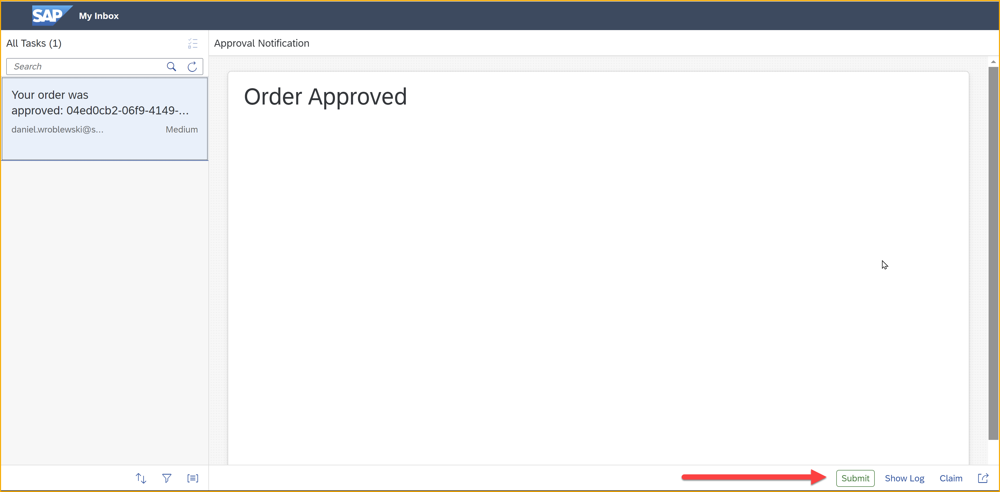

    Click **Submit**. The process continues to update the status of the order, and then completes.

6. Check the process in the monitor tab, and you can see all the steps completed.

    

    Back in your app, refresh the page and check the **My Orders** page again, and you will see the status of the order updated.

    

    >You will also notice that there is a new cart. Since you submitted the cart and changed it's status to **REQUESTED**, the app no longer had a cart. And when the app returned to the home page, it created a new cart in the CAP service.